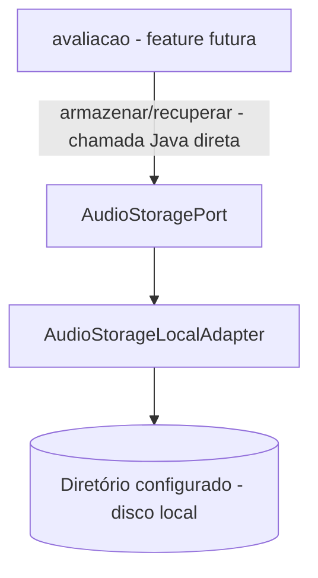

# Áudio de Avaliação Design

**Spec**: `.specs/features/audio-avaliacao/spec.md`
**Status**: Approved

---

## Architecture Overview

Um pacote novo e pequeno (`audioavaliacao`, mesmo padrão flat de `regrasclassificacao`/`bancopalavras`): uma porta (`AudioStoragePort`) com um único adapter real (`AudioStorageLocalAdapter`, disco local) e uma hierarquia de exceções própria. Sem controller, sem entidade JPA, sem tabela - a feature inteira é uma capacidade Java chamável por injeção Spring, no mesmo padrão do `RegraClassificacaoService.classificar(...)` (design.md de `regras-classificacao`, Architecture Overview) e do `HistoricoAvaliacaoPort`/`HistoricoAvaliacaoPortStub` já existentes em `cadastros.aluno` (mesma ideia, direção oposta: aqui não há stub porque `audio-avaliacao` é construída **antes** de `avaliacao`, então não há dependência para trás a resolver agora).

---

## Code Reuse Analysis

### Existing Components to Leverage

| Component | Location | How to Use |
| --- | --- | --- |
| Padrão `@Value("${APP_X:...}")` para config simples | `common/security/JwtService.java:32`, `autenticacao/AdminBootstrap.java:30-31` | Mesmo padrão para `APP_AUDIO_STORAGE_DIR`/`APP_AUDIO_TAMANHO_MAXIMO_BYTES` - nenhuma classe `@ConfigurationProperties` existe ainda no projeto, não introduzir uma só para 2 valores |
| Padrão `@PostConstruct` para validação pós-injeção | `common/security/JwtService.java:35` (`validarSegredo`) | Mesmo padrão para criar o diretório configurado e falhar cedo (no boot) se não for possível |
| Padrão porta/adapter (`XPort`/`XAdapter`) | `common/security/ContextoUsuarioPort.java` + `JwtContextoUsuarioAdapter.java` | Mesma forma: `AudioStoragePort` (interface) + `AudioStorageLocalAdapter` (`@Component`) |
| Capacidade Java pura sem HTTP, para feature futura consumir | `regrasclassificacao/RegraClassificacaoService.java:45` (`classificar`) | Mesmo padrão: `armazenar`/`recuperar` são os únicos pontos de entrada, chamados via injeção Spring quando `avaliacao` existir |

### Integration Points

| System | Integration Method |
| --- | --- |
| Sistema de arquivos local | `java.nio.file` (`Files.write`, `Files.readAllBytes`, `Files.createDirectories`), diretório base configurável via `APP_AUDIO_STORAGE_DIR` |
| `avaliacao` (futura) | Chama `AudioStoragePort.armazenar(byte[], String)`/`recuperar(String)` direto via injeção Spring - sem endpoint HTTP nesta feature (spec.md, Out of Scope) |

---

## Components

### `AudioStoragePort` (interface)

- **Purpose**: Contrato estável para guardar e recuperar bytes de áudio, independente de onde ficam gravados (AD-003: hoje disco local, podendo trocar para S3 depois sem mudar quem chama).
- **Location**: `src/main/java/com/missio/fluencia_leitora/audioavaliacao/AudioStoragePort.java`
- **Interfaces**:
  - `String armazenar(byte[] conteudo, String mimeType)` - valida formato/tamanho (AUD-03, AUD-04, Edge Cases) e devolve uma referência opaca (AUD-01)
  - `byte[] recuperar(String referencia)` - devolve os bytes originais (AUD-02) ou lança `AudioNaoEncontradoException` (AUD-06)
- **Dependencies**: nenhuma (contrato puro)
- **Reuses**: N/A (novo)

### `AudioStorageLocalAdapter` (`@Component implements AudioStoragePort`)

- **Purpose**: Único adapter real por enquanto - grava/lê arquivos num diretório local configurável.
- **Location**: `src/main/java/com/missio/fluencia_leitora/audioavaliacao/AudioStorageLocalAdapter.java`
- **Interfaces**: implementa `AudioStoragePort` (acima)
- **Dependencies**: `APP_AUDIO_STORAGE_DIR` (via `@Value`, default `data/audios` - caminho relativo ao diretório de trabalho da aplicação, só para desenvolvimento), `APP_AUDIO_TAMANHO_MAXIMO_BYTES` (via `@Value`, default `26214400` = 25 MB)
- **Reuses**: padrão `@Value`/`@PostConstruct` de `JwtService` (ver Code Reuse Analysis)

### Hierarquia de exceções (`audioavaliacao.exception` ou pacote raiz - ver Tech Decisions)

- **Purpose**: Sinalizar cada falha de `AudioStoragePort` com um tipo específico, sem acoplar esta feature a `common.error.BusinessException` (que é REST-facing; esta feature não tem controller - spec.md, Out of Scope).
- **Location**: `src/main/java/com/missio/fluencia_leitora/audioavaliacao/AudioStorageException.java` (+ 4 subclasses no mesmo pacote)
- **Interfaces**:
  - `AudioStorageException` (abstract, `extends RuntimeException`) - base comum para quem quiser um catch único
  - `AudioFormatoInvalidoException` - mime type nulo/vazio ou fora da lista permitida (AUD-03 + Edge Case)
  - `AudioTamanhoInvalidoException` - tamanho zero ou acima do limite (AUD-04 + Edge Case)
  - `AudioArmazenamentoException` - falha de escrita em disco, embrulha a `IOException` original (AUD-05)
  - `AudioNaoEncontradoException` - `recuperar` com referência que não existe (ou que resolve fora do diretório base - ver Risks & Concerns) (AUD-06)
- **Dependencies**: nenhuma
- **Reuses**: N/A (feature sem controller; quando `avaliacao` existir, seu controller decide como mapear cada uma para HTTP, igual já faz hoje com `BusinessException`)

---

## Data Models

Nenhum - esta feature não tem tabela própria (spec.md, Out of Scope: a tabela `avaliacao_audio` do SDD pertence à feature `avaliacao`, que vai gravar sua própria FK para `avaliacao(id)` e guardar a referência (string) devolvida por `armazenar` numa coluna sua).

---

## Error Handling Strategy

| Error Scenario | Handling | User Impact |
| --- | --- | --- |
| `mimeType` nulo, vazio ou fora de `audio/webm`, `audio/ogg`, `audio/mp4`, `audio/mpeg`, `audio/wav` | `AudioFormatoInvalidoException`, nada é escrito no disco | Decidido pelo chamador (`avaliacao` mapeia para HTTP quando existir) |
| `conteudo` com tamanho zero ou maior que `APP_AUDIO_TAMANHO_MAXIMO_BYTES` | `AudioTamanhoInvalidoException`, nada é escrito no disco | idem |
| Falha de escrita (`IOException` - disco cheio, sem permissão) | `AudioArmazenamentoException` (embrulha a causa); qualquer arquivo parcial já criado é excluído antes de propagar | idem |
| `recuperar` com referência que não existe no diretório base, ou que resolve fora dele | `AudioNaoEncontradoException` | idem |
| Diretório configurado não existe | Criado automaticamente no `@PostConstruct` do adapter (`Files.createDirectories`); se a criação falhar, a aplicação não sobe (`AudioArmazenamentoException` no boot) | Falha rápida e visível, não silenciosa na primeira gravação |

---

## Risks & Concerns

| Concern | Location (file:line) | Impact | Mitigation |
| --- | --- | --- | --- |
| `recuperar(String referencia)` aceita uma string livre; hoje só recebe o que `armazenar` gerou, mas nada no tipo impede uma chamada futura de passar entrada externa (ex.: se `avaliacao` um dia expuser `referencia` bruta num endpoint) | `AudioStorageLocalAdapter` (novo) | Um `referencia` como `../../etc/passwd` poderia, sem checagem, tentar ler fora do diretório configurado | O adapter resolve o caminho e confirma que o resultado fica dentro do diretório base antes de ler; fora disso, trata como `AudioNaoEncontradoException` (mesmo comportamento de "não existe", sem vazar a diferença entre "não existe" e "fora do diretório") |
| Escrita não atômica (grava direto no arquivo final) | `AudioStorageLocalAdapter` (novo) | Uma falha no meio da escrita (ex.: disco enche na metade) pode deixar um arquivo truncado no diretório | AUD-05: qualquer `IOException` durante a escrita aciona a exclusão do arquivo parcial antes de propagar `AudioArmazenamentoException` |
| Sem cota agregada de espaço em disco (só validação por arquivo, `APP_AUDIO_TAMANHO_MAXIMO_BYTES`) | `AudioStorageLocalAdapter` (novo) | Uso indevido prolongado pode encher o disco mesmo com cada arquivo dentro do limite | Fora de escopo desta feature (spec.md não pede cota agregada); risco aceito - fica para uma feature de observabilidade/operação, se necessário |

> Nenhum outro risco encontrado na área tocada por esta feature.

---

## Tech Decisions

| Decision | Choice | Rationale |
| --- | --- | --- |
| `armazenar` não recebe `nomeOriginal` do chamador | Assinatura é só `(byte[] conteudo, String mimeType)` | A extensão do arquivo em disco vem de uma tabela fixa `mimeType → extensão` (5 entradas, a mesma lista permitida); satisfaz a AC8 do spec ("nunca derivado do nome original") **por construção** - não existe parâmetro de nome para derivar, então não precisa de sanitização nem de um teste dedicado além dos testes de unicidade/AUD-08 |
| Referência devolvida = nome do arquivo gerado (`UUID + extensão`), diretório sempre plano (sem sharding por data) | Sem subpastas | Volume esperado (uma escola) não justifica sharding; se o volume crescer, é uma mudança isolada dentro do adapter, sem afetar `AudioStoragePort` |
| Config via `@Value` com nomes `APP_*` (não uma classe `@ConfigurationProperties`) | `APP_AUDIO_STORAGE_DIR`, `APP_AUDIO_TAMANHO_MAXIMO_BYTES` | Seguindo o padrão já estabelecido (`APP_JWT_SECRET`, `APP_ADMIN_EMAIL/PASSWORD`) - seria inconsistente introduzir um mecanismo de configuração novo para 2 valores |
| Diretório criado no `@PostConstruct` do adapter (fail-fast no boot) | Não espera a primeira gravação | Mesmo padrão de `JwtService.validarSegredo()` - erro de configuração aparece no boot, não na primeira chamada de um usuário |
| `recuperar` devolve `byte[]` (não `InputStream`/`Resource`) | Carrega o arquivo inteiro em memória | Simplicidade suficiente dado o limite de 25 MB por arquivo; se `avaliacao` precisar de streaming HTTP para não carregar tudo em memória, decide isso quando construir seu próprio endpoint - não é um requisito desta feature |

> **Nenhuma decisão acima** cria um padrão exclusivo novo - todas seguem convenções já em uso no projeto (porta/adapter, `@Value`, `@PostConstruct`) ou já demonstradas por `regras-classificacao`/`HistoricoAvaliacaoPort` (capacidade Java pura para feature futura consumir). Não promovida a `STATE.md` `## Decisions`.

---

## Tips

- O ponto novo de verdade é I/O de arquivo - primeiro uso de `java.nio.file` no projeto; os testes usam `@TempDir` do JUnit, não precisam de Spring context nem de Docker (feature sem DB).
- `armazenar`/`recuperar` são a interface pública que `avaliacao` vai chamar depois - manter a assinatura estável, igual ao `classificar(int serie, int acertos)` de `regras-classificacao`.
