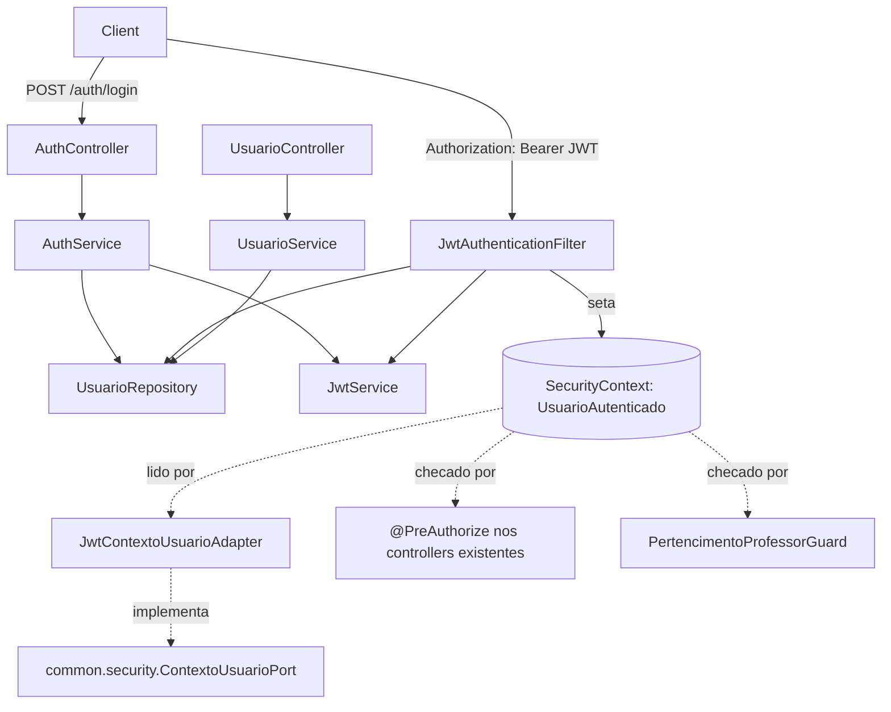

# Autenticação e Perfis Design

**Spec**: `.specs/features/autenticacao-perfis/spec.md`
**Status**: Approved

---

## Architecture Overview

Spring Security 7 (via `spring-boot-starter-security`, ainda não está no `pom.xml`) com um `SecurityFilterChain` stateless: um `JwtAuthenticationFilter` (`OncePerRequestFilter`) valida o JWT (HS256, biblioteca `jjwt` 0.13.0 - `jjwt-api`/`jjwt-impl`/`jjwt-jackson`, confirmada via busca como a versão atual com a API `Jwts.builder()...signWith(key).compact()` / `Jwts.parser().verifyWith(key).build().parseSignedClaims(token)`), carrega o `Usuario` do banco (para checar `ativo` a cada requisição - é assim que AUTH-10 revoga sem precisar de blacklist de token) e popula o `SecurityContext` com um principal customizado (`UsuarioAutenticado`) que carrega `usuarioId`, `perfil` e `professorId` **lidos do banco**, não do claim do token (evita confiar em claim desatualizado se o perfil/professor mudar). `@PreAuthorize("hasRole('COORDENADOR')")`/`hasRole('PROFESSOR')` (via `@EnableMethodSecurity`) nos controllers de cada feature cobre AUTH-07/AUTH-08. O escopo "professor só vê o que é dele" (AUTH-09, 404) é um guard de aplicação reutilizável, não um mecanismo de Spring Security.



---

## Code Reuse Analysis

### Existing Components to Leverage

| Component | Location | How to Use |
| --- | --- | --- |
| `common.error.BusinessException` + `GlobalExceptionHandler` | `common/error/` | Reusa para 409 `EMAIL_DUPLICADO`, 422 de validação; adiciona um `AuthenticationEntryPoint`/`AccessDeniedHandler` no `GlobalExceptionHandler` (ou classe irmã) para converter 401/403 do Spring Security no mesmo formato `ProblemDetail` |
| `common.security.ContextoUsuarioPort` (interface) | `common/security/ContextoUsuarioPort.java` | Mantém a interface (contrato já consumido por `AlunoService`/`AlunoController` em `cadastros-base`); esta feature entrega o adapter real |
| `common.security.Perfil` | `common/security/Perfil.java` | Reusa sem mudança (`COORDENADOR`, `PROFESSOR`) |
| `common.security.ContextoUsuarioHeaderAdapter` | `common/security/ContextoUsuarioHeaderAdapter.java` | **Removido** por esta feature (ver Tech Decisions) - era provisório e spoofável por header; os testes de `cadastros-base` que o usavam são atualizados para gerar um JWT real |
| `professor` (entidade/repositório) | `cadastros/professor/` | `Usuario.professorId` referencia `Professor.id`; validação de `professorId` existente/ativo reusa `ProfessorRepository` |

### Integration Points

| System | Integration Method |
| --- | --- |
| `spring-boot-starter-security` | Nova dependência no `pom.xml` (não está lá ainda) |
| `jjwt` 0.13.0 (`jjwt-api`, `jjwt-impl` runtime, `jjwt-jackson` runtime) | Nova dependência no `pom.xml` |
| `cadastros-base` (controllers existentes) | Esta feature **retrofita** `AnoLetivoController`, `ProfessorController`, `TurmaController`, `AlunoController`, `MatriculaController` com `@PreAuthorize` nos métodos de escrita (todos `COORDENADOR`-only, conforme a assumption "quem cadastra alunos" do spec de `cadastros-base`) |
| Features futuras (`avaliacao`, `audio-avaliacao`, `banco-palavras`, `regras-classificacao`) | Vão reusar `PertencimentoProfessorGuard` e `@PreAuthorize` do mesmo jeito - não é retrofit, é o padrão desde o início dessas features |

---

## Retrofit necessário em `cadastros-base` (decisão explícita, não é scope creep)

O spec desta feature (`autenticacao-perfis`) exige 403 em escrita de cadastros por PROFESSOR (AUTH-07) e 404 ao acessar aluno de outro professor (AUTH-09), com um "Independent Test" que testa isso contra endpoints reais de `cadastros-base`. `cadastros-base` foi implementada **antes** de existir autenticação (por decisão de ordem do usuário), então:

1. `AnoLetivoController`, `ProfessorController`, `TurmaController`, `AlunoController` (métodos de escrita), `MatriculaController` ganham `@PreAuthorize("hasRole('COORDENADOR')")`.
2. `cadastros-base` não tem hoje nenhum endpoint de leitura de **um** aluno específico por id (só a busca paginada, que já filtra por professor). O AC "404 ao acessar um aluno de outro professor" (Independent Test do spec desta feature) não tem onde acontecer sem um endpoint assim. Esta feature adiciona `GET /api/v1/alunos/{id}` em `AlunoController` (endpoint pequeno e justificado: é o único jeito de exercitar AUTH-09 de forma concreta agora; sem ele, AUTH-09 ficaria sem teste real até a feature `avaliacao` existir, o que é tarde demais para um requisito P1 desta feature).
3. Os testes de integração de `cadastros-base` que hoje simulam o contexto do usuário via os headers `X-Perfil`/`X-Professor-Id` (`AlunoControllerIT`, principalmente) passam a gerar um JWT real (usando o `JwtService` desta feature) em vez de enviar os headers - os headers deixam de ter efeito porque `ContextoUsuarioHeaderAdapter` é removido.

Isso é reportado como uma decisão de projeto (ver Tech Decisions), não como um efeito colateral silencioso.

---

## Components

### `autenticacao.Usuario` (entidade)

- **Purpose**: Credenciais + perfil + vínculo opcional com professor.
- **Location**: `src/main/java/com/missio/fluencia_leitora/autenticacao/Usuario.java`
- **Campos**: `id`, `email` (único, sempre normalizado para minúsculas antes de persistir - dispensa collation especial), `senhaHash` (BCrypt via `PasswordEncoder`), `perfil` (`Perfil`), `professorId` (nullable, FK para `professor.id`), `ativo`, `tentativasFalhas` (int, default 0), `bloqueadoAte` (`Instant`, nullable), `version`, `criadoEm`/`atualizadoEm`.
- **Reuses**: `common.security.Perfil`

### `autenticacao.UsuarioRepository`

- **Interfaces**: `findByEmailIgnoreCase(String email)`, e duas `@Modifying @Query` de UPDATE atômico: `registrarFalha(Long id, Instant bloqueadoAteSeAtingiuLimite)` (incrementa `tentativasFalhas`, seta `bloqueadoAte` só quando o contador bate 5 - numa única instrução `UPDATE`, conforme o spec exige) e `zerarFalhas(Long id)` (reseta `tentativasFalhas=0`, `bloqueadoAte=null`).

### `autenticacao.AuthService`

- **Purpose**: `login(email, senha)` - orquestra AUTH-01 a AUTH-06: busca por e-mail (case-insensitive), 401 genérico se não existe/inativo/senha errada (mesma mensagem nos três casos, sem vazar qual caso é), 429 com `Retry-After` se bloqueado, `registrarFalha`/`zerarFalhas` conforme o resultado, log INFO/WARN sem senha (AUTH-05).
- **Interfaces**: `LoginResult login(String email, String senhaPlana)`
- **Reuses**: `PasswordEncoder` (Spring Security), `JwtService`

### `common.security.JwtService`

- **Purpose**: Emitir e validar tokens HS256. Lê `APP_JWT_SECRET` de variável de ambiente; falha a inicialização (`ApplicationContextException`/`IllegalStateException` num `@PostConstruct`) se tiver menos de 32 bytes (edge case do spec).
- **Interfaces**: `String emitir(Long usuarioId)` (claim `sub`=usuarioId, `exp`=+8h), `Optional<Long> validarERetornarUsuarioId(String token)` (retorna vazio se assinatura inválida, expirado ou malformado - nunca lança para fora do filtro)
- **Reuses**: `jjwt`

### `common.security.JwtAuthenticationFilter` (`OncePerRequestFilter`)

- **Purpose**: Lê `Authorization: Bearer <token>`, valida via `JwtService`, carrega `Usuario` (checa `ativo`), popula `SecurityContext` com `UsuarioAutenticado` (principal) + `ROLE_<perfil>` como `GrantedAuthority`.
- **Reuses**: `JwtService`, `UsuarioRepository`

### `common.security.SecurityConfig`

- **Purpose**: `SecurityFilterChain` stateless (`SessionCreationPolicy.STATELESS`), libera `/api/v1/auth/login`, `/v3/api-docs/**`, `/swagger-ui/**`, `/actuator/health`; exige autenticação no resto; registra `JwtAuthenticationFilter` antes do filtro padrão de autenticação; `@EnableMethodSecurity` para os `@PreAuthorize` dos controllers; `AuthenticationEntryPoint` (401) e `AccessDeniedHandler` (403) customizados devolvendo `ProblemDetail` no mesmo formato do `GlobalExceptionHandler`.

### `common.security.JwtContextoUsuarioAdapter implements ContextoUsuarioPort`

- **Purpose**: Substitui `ContextoUsuarioHeaderAdapter` (removido). Lê `UsuarioAutenticado` de `SecurityContextHolder.getContext().getAuthentication().getPrincipal()`.
- **Reuses**: `common.security.ContextoUsuarioPort` (interface já existente)

### `common.security.PertencimentoProfessorGuard`

- **Purpose**: Helper reutilizável para AUTH-09 - `verificar(Long professorIdDoRecurso)` lança `BusinessException(404, "RECURSO_NAO_ENCONTRADO", ...)` quando `ContextoUsuarioPort.perfilAtual()==PROFESSOR` e `professorIdDoRecurso` não bate com `professorIdAtual()`. Usado por `AlunoController.buscarPorId` (novo, nesta feature) e reusado pelas features futuras (`avaliacao`, `audio-avaliacao`) sempre que expuserem um recurso de "dono" único.
- **Location**: `src/main/java/com/missio/fluencia_leitora/common/security/PertencimentoProfessorGuard.java`

### `autenticacao.UsuarioService` + `UsuarioController`

- **Purpose**: CRUD de usuários (AUTH-11 a AUTH-14) - `POST /api/v1/usuarios`, `PUT /api/v1/usuarios/{id}/senha`. Valida perfil×professorId (422), e-mail único (409 `EMAIL_DUPLICADO`), senha ≥8 caracteres (422). Nunca retorna senha/hash.

### `autenticacao.AdminBootstrap` (`ApplicationRunner`)

- **Purpose**: Na inicialização, se `UsuarioRepository.count()==0`: cria COORDENADOR com `APP_ADMIN_EMAIL`/`APP_ADMIN_PASSWORD` (se definidos) ou loga WARN "Nenhum usuário cadastrado" e segue (edge case do spec).

---

## Data Models

```java
class Usuario {
    Long id;
    String email;            // único, sempre lowercase
    String senhaHash;        // BCrypt
    Perfil perfil;           // COORDENADOR | PROFESSOR
    Long professorId;        // FK professor.id, obrigatório sse perfil==PROFESSOR
    boolean ativo;
    int tentativasFalhas;
    Instant bloqueadoAte;    // null quando não bloqueado
    Long version;
    Instant criadoEm;
    Instant atualizadoEm;
}

record UsuarioAutenticado(Long usuarioId, Perfil perfil, Long professorId) {}
```

**Relacionamentos**: `Usuario.professorId` referencia `Professor.id` (sem `@ManyToOne` obrigatório - é só uma FK simples, não precisamos navegar o grafo a partir de `Usuario`).

---

## Error Handling Strategy

| Error Scenario | Handling | User Impact |
| --- | --- | --- |
| Sem token / token inválido / expirado / usuário inativo/revogado | `AuthenticationEntryPoint` | `ProblemDetail` 401 |
| Perfil sem permissão para o endpoint (`@PreAuthorize` falha) | `AccessDeniedHandler` | `ProblemDetail` 403 |
| Professor acessando recurso de outro professor | `PertencimentoProfessorGuard` → `BusinessException` | `ProblemDetail` 404 (não revela existência) |
| 5 falhas de login seguidas | `AuthService` retorna estado "bloqueado"; `AuthController` seta header `Retry-After` | `ProblemDetail` 429 |
| E-mail duplicado / senha curta / perfil×professorId inconsistente | `BusinessException`/`@Valid` (já existentes) | 409/422 |

---

## Risks & Concerns

| Concern | Location (file:line) | Impact | Mitigation |
| --- | --- | --- | --- |
| Retrofit toca 5 controllers já testados e passando (`cadastros-base`) | `cadastros/**/Controller.java` | Risco de quebrar testes existentes ao adicionar `@PreAuthorize` e trocar o mecanismo de contexto de usuário | Cada controller retrofitado roda seu próprio `*ControllerIT` de novo (gate `full`) antes do commit da task; `AlunoControllerIT` é atualizado para gerar JWT real em vez de headers, na mesma task que remove `ContextoUsuarioHeaderAdapter` |
| Verificação de `ativo` por requisição exige 1 SELECT extra por chamada autenticada | `JwtAuthenticationFilter` | Latência extra pequena (PK lookup indexado); aceitável na escala de uma escola | Nenhuma - é a troca certa dado que não há blacklist de token (decisão do spec: sem refresh/logout no servidor) |
| `APP_JWT_SECRET` curto quebra o boot inteiro | `JwtService` (`@PostConstruct`) | Se não configurado em produção, a aplicação não sobe | É o comportamento exigido pelo spec (edge case); documentar no README/env de exemplo |
| Login de força bruta contra e-mails que não existem não é limitado (só contas existentes bloqueiam) | `AuthService.login` | Um atacante pode tentar e-mails aleatórios sem limite | Fora do escopo do spec (RNF002 cobre "conta existente"); não introduzir rate-limit por IP não pedido - seria scope creep |
| AUTH-08 (403 quando COORDENADOR chama endpoint de execução de avaliação) não tem onde ser testado concretamente - `avaliacao`/`audio-avaliacao` ainda não existem, nenhum controller de "criar avaliação, marcar palavra, enviar áudio" existe hoje | N/A (feature futura) | O AC ficaria sem verificação real nesta feature | Diferente de AUTH-09, não dá para criar um endpoint só para isso sem inventar escopo de outra feature; o mecanismo (`@PreAuthorize("hasRole('PROFESSOR')")`) já é o mesmo comprovado por AUTH-07 (só troca o papel exigido). Documentado em `spec.md` como "mecanismo provado via AUTH-07; aplicação concreta é tarefa da feature `avaliacao`" em vez de fingir cobertura que não existe |

---

## Tech Decisions

| Decision | Choice | Rationale |
| --- | --- | --- |
| Biblioteca JWT | `jjwt` 0.13.0 (API moderna `Jwts.builder()`/`Jwts.parser().verifyWith()`) | Confirmado via busca como a versão atual, compatível com a API usada no design |
| Fonte de perfil/professorId por requisição | Sempre relida do banco no filtro (não confia no claim do JWT) | Mais simples e correto para AUTH-10 (revogação) do que manter uma blacklist de tokens; claims carregam só o `usuarioId` |
| `ContextoUsuarioHeaderAdapter` | Removido (não só substituído por `@Primary`) | Um bypass de autenticação por header não pode continuar existindo em código depois que autenticação real existe - é um risco de segurança, não uma opção de configuração |
| `GET /api/v1/alunos/{id}` | Adicionado nesta feature, não em `cadastros-base` | É o único endpoint que permite testar AUTH-09 (404 cross-professor) concretamente agora; sem ele o AC ficaria sem verificação real até `avaliacao` existir |
| Guard de "pertencimento ao professor" | Helper reutilizável (`PertencimentoProfessorGuard`) em vez de repetir a checagem em cada controller | Evita duplicar a mesma regra em `avaliacao`/`audio-avaliacao` mais tarde |
| Autorização por perfil | `@PreAuthorize` método a método nos controllers existentes, não um mapa central de rotas | Consistente com o estilo já usado (Spring, anotações), e cada controller já sabe quais dos seus métodos são de escrita |

> **Decisão de projeto**: o padrão "porta provisória resolvida por uma feature futura, sem os consumidores mudarem" (`ContextoUsuarioPort`) funcionou exatamente como planejado em AD-003/cadastros-base - `AlunoService`/`AlunoController` não mudam nada, só o bean por trás da interface troca. Nenhuma nova `AD-NNN` é necessária; isso confirma AD-003 em vez de alterá-la.
