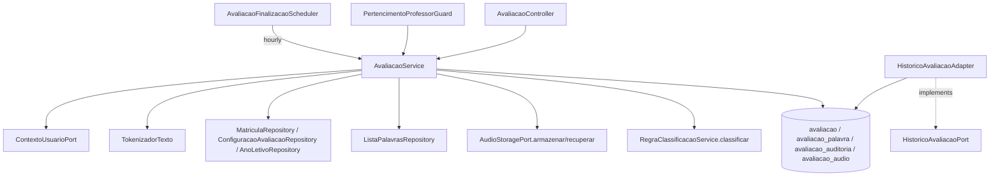

# Avaliação de Leitura Design

**Spec**: `.specs/features/avaliacao/spec.md`
**Context**: `.specs/features/avaliacao/context.md`
**Status**: Draft

---

## Architecture Overview

Um pacote novo, `avaliacao` (mesmo nível de `regrasclassificacao`, `bancopalavras`, `audioavaliacao`), com um único `AvaliacaoService` orquestrando o ciclo de vida inteiro. Sem State pattern nem FSM: cada ação é um método de serviço que (1) recarrega a avaliação, (2) roda a finalização preguiçosa se o tempo já estourou, (3) valida a transição contra uma tabela estática, (4) aplica o efeito, (5) salva - o mesmo estilo usado em `RegraClassificacaoService`/`MatriculaService` (decisão confirmada com o usuário).



---

## Code Reuse Analysis

### Existing Components to Leverage

| Component | Location | How to Use |
| --- | --- | --- |
| `RegraClassificacaoService.classificar(int serie, int acertos)` | `regrasclassificacao/RegraClassificacaoService.java:45` | Chamada direta na finalização e em todo recálculo pós-finalização |
| `AudioStoragePort` (+ 4 exceptions) | `audioavaliacao/AudioStoragePort.java` | Injetado no `AvaliacaoService`; `armazenar`/`recuperar` nos dois novos endpoints de áudio |
| `TokenizadorTexto.tokenizar(String)` | `common/texto/TokenizadorTexto.java:24` | Texto digitado (TEXTO_CURTO) vira as palavras copiadas (AVA-08) |
| `TipoLeituraCodigo`, `TipoPalavra` (enums) | `bancopalavras/TipoLeituraCodigo.java`, `bancopalavras/TipoPalavra.java` | Reusados sem duplicar - `avaliacao.tipoLeitura` e `avaliacao_palavra.tipo_palavra` usam os mesmos enums que `lista_palavras`/`item_lista_palavras` |
| `Fase` (enum) | `regrasclassificacao/Fase.java` | Reusado para `avaliacao.fase` |
| `ListaPalavrasRepository` | `bancopalavras/ListaPalavrasRepository.java` | Buscar a lista + itens quando a origem é `listaPalavrasId` (AVA-01/AVA-05) |
| `ContextoUsuarioPort` | `common/security/ContextoUsuarioPort.java` | `usuarioIdAtual()` para auditoria/log; `professorIdAtual()`/`perfilAtual()` para autorização |
| `PertencimentoProfessorGuard` | `common/security/PertencimentoProfessorGuard.java` | 404 quando um PROFESSOR tenta acessar avaliação de outro professor (edge case AUTH-09) |
| `BusinessException` + `GlobalExceptionHandler` | `common/error/` | Todos os códigos de erro (`ProblemDetail` + `code`); `ObjectOptimisticLockingFailureException` → `CONFLITO_DE_VERSAO` já mapeado, reusado tal qual para AVA-25 |
| `Matricula`, `Aluno`, `AnoLetivo`, `ConfiguracaoAvaliacao`, `Professor`, `Turma` | `cadastros/**` | Validação de elegibilidade (AVA-02), limites de palavras (AVA-03), período do ano letivo (AVA-06), cópias (AVA-01) |
| `Ciclo` (domínio fixo) | `cadastros/dominio/Ciclo.java` | FK `cicloId` na avaliação, mesmo padrão de referência usado no resto do cadastro |
| `HistoricoAvaliacaoPort` (interface) | `cadastros/aluno/HistoricoAvaliacaoPort.java` | Esta feature fornece o adapter `@Primary` real, substituindo `HistoricoAvaliacaoPortStub` |

### Integration Points

| System | Integration Method |
| --- | --- |
| `regras-classificacao` | Injeção Spring de `RegraClassificacaoService`, chamada Java direta (mesmo padrão já documentado em `.specs/STATE.md`, Handoff) |
| `audio-avaliacao` | Injeção Spring de `AudioStoragePort` (bean real `AudioStorageLocalAdapter`, sem HTTP) |
| `banco-palavras` | Leitura via `ListaPalavrasRepository`; `TokenizadorTexto` e os enums `TipoLeituraCodigo`/`TipoPalavra` importados diretamente do pacote `bancopalavras` |
| `cadastros-base` | Leitura via `MatriculaRepository`/`AlunoRepository`/`ConfiguracaoAvaliacaoRepository`/`AnoLetivoRepository`; esta feature grava o bean real de `HistoricoAvaliacaoPort`, tornando `HistoricoAvaliacaoPortStub` não-primário (ele continua existindo, apenas deixa de ser `@Primary`/único) |
| Banco de dados | Migração Flyway nova: `avaliacao`, `avaliacao_palavra`, `avaliacao_auditoria`, `avaliacao_audio` (ver Data Models) |

---

## Components

### `Avaliacao` (entity, agregado raiz)

- **Purpose**: Estado, configuração, cópias e resultado de uma avaliação.
- **Location**: `avaliacao/Avaliacao.java`
- **Dependencies**: `Aluno`, `AnoLetivo`, `Ciclo` (FKs `@ManyToOne`); `PalavraAvaliacao` (`@OneToMany`, cascade ALL, orphanRemoval, `@OrderBy("ordem")`)
- **Reuses**: mesmo padrão de agregado de `ListaPalavras`/`ItemListaPalavras`

### `PalavraAvaliacao` (entity)

- **Purpose**: Uma palavra copiada para a avaliação, com seu status de leitura.
- **Location**: `avaliacao/PalavraAvaliacao.java`
- **Dependencies**: só existe dentro do ciclo de vida de `Avaliacao`

### `AvaliacaoAuditoria` (entity)

- **Purpose**: Um registro imutável de alteração numa avaliação `FINALIZADA` ou de um cancelamento.
- **Location**: `avaliacao/AvaliacaoAuditoria.java`
- **Dependencies**: `Avaliacao` (`@ManyToOne`)

### `AvaliacaoAudio` (entity)

- **Purpose**: A referência (não os bytes) do áudio de uma avaliação.
- **Location**: `avaliacao/AvaliacaoAudio.java`
- **Dependencies**: `Avaliacao` (`@OneToOne`, `avaliacao_id` único)

### `AvaliacaoRepository`, `AvaliacaoAuditoriaRepository`, `AvaliacaoAudioRepository`

- **Purpose**: Persistência; `PalavraAvaliacao` não tem repositório próprio (acessada via a coleção do agregado, como `ItemListaPalavras`).
- **Location**: `avaliacao/*Repository.java`
- **Interfaces** (métodos não triviais):
  - `AvaliacaoRepository.existsByAlunoIdAndStatusNot(Long alunoId, StatusAvaliacao status): boolean` - usado pelo `HistoricoAvaliacaoAdapter`
  - `AvaliacaoRepository.findByStatusAndIniciadoEmBefore(StatusAvaliacao status, Instant limite): List<Avaliacao>` - usado pelo scheduler (`EM_ANDAMENTO` + `ultimaAtividadeEm < agora - 24h`, ver Tech Decisions)
  - `AvaliacaoAuditoriaRepository.findByAvaliacaoIdOrderByDataHoraAsc(Long avaliacaoId): List<AvaliacaoAuditoria>`
  - `AvaliacaoAudioRepository.findByAvaliacaoId(Long avaliacaoId): Optional<AvaliacaoAudio>`

### `AvaliacaoService`

- **Purpose**: Toda a lógica de negócio - criação, transições, marcação, resultado/classificação, cancelamento, áudio.
- **Location**: `avaliacao/AvaliacaoService.java`
- **Interfaces**:
  - `criar(NovaAvaliacaoRequest): Avaliacao` - AVA-01..AVA-08
  - `iniciar(Long id): Avaliacao`, `pausar(Long id): Avaliacao`, `continuar(Long id): Avaliacao`, `resetar(Long id): Avaliacao`, `finalizar(Long id): Avaliacao` - AVA-09..AVA-14, AVA-17
  - `marcarPalavra(Long id, int ordem, StatusPalavra status): Avaliacao` - AVA-15, AVA-18, AVA-19
  - `marcarPalavras(Long id, List<MarcacaoItem> itens): Avaliacao` - AVA-15 (lote, tudo ou nada)
  - `cancelar(Long id, String justificativa): Avaliacao` - AVA-24
  - `buscar(Long id): Avaliacao` - AVA-23 (roda a finalização preguiçosa antes de retornar, ver Tech Decisions)
  - `consultarAuditoria(Long id): List<AvaliacaoAuditoria>` - AVA-26
  - `enviarAudio(Long id, byte[] conteudo, String mimeType): AvaliacaoAudio` - AVA-27..AVA-30
  - `baixarAudio(Long id): AudioBaixado` (bytes + mimeType) - AVA-31, AVA-32
  - `finalizarInativas(): int` - AVA-17 (chamado pelo scheduler)
- **Dependencies**: os repositórios acima + `RegraClassificacaoService`, `AudioStoragePort`, `ListaPalavrasRepository`, `MatriculaRepository`, `AlunoRepository`, `ConfiguracaoAvaliacaoRepository`, `AnoLetivoRepository`, `TokenizadorTexto`, `ContextoUsuarioPort`, `PertencimentoProfessorGuard`
- **Reuses**: todos os itens da tabela de Code Reuse acima

### `AvaliacaoController`

- **Purpose**: Endpoints REST de `/api/v1/avaliacoes`.
- **Location**: `avaliacao/AvaliacaoController.java`
- **Interfaces**: um `@PostMapping`/`@PutMapping`/`@GetMapping` por AC de endpoint do spec (12 rotas); `@PreAuthorize("hasRole('PROFESSOR')")` nas de escrita, `@PreAuthorize("hasAnyRole('PROFESSOR','COORDENADOR')")` nas de leitura (`GET .../{id}`, `.../auditoria`, `.../audio`) - mesmo padrão de `MatriculaController`
- **Reuses**: DTOs seguem o padrão `XxxRequest`/`XxxResponse` com bean validation, como em `regrasclassificacao/dto`

### `HistoricoAvaliacaoAdapter`

- **Purpose**: Implementação real de `HistoricoAvaliacaoPort` (a de `cadastros-base` era um stub provisório).
- **Location**: `avaliacao/HistoricoAvaliacaoAdapter.java`
- **Interfaces**: `@Primary @Component class HistoricoAvaliacaoAdapter implements HistoricoAvaliacaoPort`
- **Dependencies**: `AvaliacaoRepository`
- **Reuses**: `existeAvaliacaoNaoCancelada(alunoId)` → `avaliacaoRepository.existsByAlunoIdAndStatusNot(alunoId, StatusAvaliacao.CANCELADA)`. `HistoricoAvaliacaoPortStub` continua no código (deixa de ser o único bean; sem `@Primary` ele perde a resolução por padrão) - nenhuma mudança necessária em `cadastros-base`.

### `AvaliacaoFinalizacaoScheduler`

- **Purpose**: Job de hora em hora que força a finalização de avaliações `EM_ANDAMENTO` inativas há mais de 24h (AVA-17, Edge Cases).
- **Location**: `avaliacao/AvaliacaoFinalizacaoScheduler.java`
- **Interfaces**: `@Scheduled(cron = "0 0 * * * *") void finalizarInativas()`
- **Dependencies**: `AvaliacaoService.finalizarInativas()`
- **Reuses**: nada existente - é o primeiro `@Scheduled` do projeto; `@EnableScheduling` precisa ser adicionado (`FluenciaLeitoraApplication` ou uma `@Configuration` nova)

---

## Data Models

### `avaliacao`

```typescript
interface Avaliacao {
  id: number
  alunoId: number            // FK aluno, estável
  professorId: number        // cópia da matrícula no momento da criação
  professorNome: string
  turmaId: number
  turmaNome: string
  serie: number
  anoLetivoId: number
  cicloId: number             // FK ciclo (domínio fixo)
  tipoLeitura: 'PALAVRA' | 'PSEUDOPALAVRA' | 'TEXTO_CURTO'
  dataAvaliacao: string        // DATE
  tempoConfiguradoSegundos: number
  tempoAcumuladoSegundos: number   // soma dos trechos já concluídos (iniciar→pausar/finalizar)
  iniciadoEm: string | null        // timestamp do início do trecho em andamento (null se não EM_ANDAMENTO)
  ultimaAtividadeEm: string        // tocado em toda ação (Tech Decisions) - usado pelo scheduler
  finalizadoEm: string | null
  tempoUtilizadoSegundos: number | null   // só após finalizar
  status: 'CRIADA' | 'EM_ANDAMENTO' | 'PAUSADA' | 'FINALIZADA' | 'CANCELADA'
  quantidadeTotal: number
  quantidadeCorretas: number
  quantidadeIncorretas: number
  quantidadeNaoLidas: number
  percentualAcerto: number | null   // DECIMAL(5,2)
  fase: 'PRE_LEITOR' | 'LEITOR_INICIANTE' | 'LEITOR_FLUENTE' | null
  nivel: number | null
  version: number
  criadoEm: string
}
```

**Relationships**: `1—N` com `PalavraAvaliacao`; `1—N` com `AvaliacaoAuditoria`; `1—1` com `AvaliacaoAudio`.

### `avaliacao_palavra`

```typescript
interface PalavraAvaliacao {
  id: number
  avaliacaoId: number
  ordem: number                 // 1..n, único por avaliacaoId
  palavra: string
  tipoPalavra: 'CANONICA' | 'NAO_CANONICA' | null
  status: 'PENDENTE' | 'CORRETA' | 'INCORRETA' | 'NAO_LIDA'
}
```

### `avaliacao_auditoria`

```typescript
interface AvaliacaoAuditoria {
  id: number
  avaliacaoId: number
  usuarioId: number
  dataHora: string
  acao: 'MARCACAO_PALAVRA' | 'CANCELAMENTO'
  valorAnterior: string   // texto descritivo (ver Tech Decisions)
  valorNovo: string
  justificativa: string | null   // só em CANCELAMENTO
}
```

### `avaliacao_audio`

```typescript
interface AvaliacaoAudio {
  id: number
  avaliacaoId: number        // único
  referenciaArmazenamento: string   // retorno de AudioStoragePort.armazenar
  mimeType: string
  tamanhoBytes: number
  criadoEm: string
}
```

---

## Error Handling Strategy

| Error Scenario | Handling | User Impact |
| --- | --- | --- |
| Transição de status não permitida | `BusinessException(409, TRANSICAO_INVALIDA, ..., {statusAtual, acao})` | 409 com o status atual e a ação pedida |
| Ação repetida no status que ela produziria | Sem exceção - retorna o estado atual (200) | Idempotência transparente |
| Aluno não avaliável / limite de palavras / conteúdo inválido / lista incompatível / 1º ano com não-canônica | `BusinessException(422, <código do AC>, ...)` | 422 com o código e os dados extras do AC |
| Marcação bloqueada (CRIADA/CANCELADA) | `BusinessException(409, MARCACAO_NAO_PERMITIDA, ...)` | 409 |
| Envio de áudio fora de FINALIZADA / duplicado | `BusinessException(409, AUDIO_ENVIO_NAO_PERMITIDO \| AUDIO_JA_ENVIADO, ...)` | 409 |
| `AudioFormatoInvalidoException` / `AudioTamanhoInvalidoException` (de `AudioStoragePort`) | Capturadas no service e relançadas como `BusinessException(422, AUDIO_FORMATO_INVALIDO \| AUDIO_TAMANHO_INVALIDO, ...)` | 422 |
| `AudioArmazenamentoException` / `AudioNaoEncontradoException` | Não capturadas - sobem como 500 (`ResponseEntityExceptionHandler` padrão) | 500 genérico - falha de infraestrutura, não de negócio |
| Duas escritas concorrentes na mesma avaliação | `ObjectOptimisticLockingFailureException` → já mapeado para `CONFLITO_DE_VERSAO` (409) em `GlobalExceptionHandler` | Reuso direto, nenhum código novo |
| Acesso a avaliação de aluno de outro professor | `PertencimentoProfessorGuard.verificar(avaliacao.getProfessorId())` → `BusinessException(404, RECURSO_NAO_ENCONTRADO, ...)` | 404, reuso direto |

---

## Risks & Concerns

| Concern | Location (file:line) | Impact | Mitigation |
| --- | --- | --- | --- |
| Nenhum `@Scheduled` existe hoje no projeto | `FluenciaLeitoraApplication.java` | O job de 24h de AVA-17 não roda sem `@EnableScheduling` | Adicionar `@EnableScheduling` na classe da aplicação (ou numa `@Configuration` dedicada) como parte da primeira task desta feature que precisar do scheduler |
| `AvaliacaoAudioRepository.findByAvaliacaoId` + o `POST` de áudio não são atomicamente exclusivos sob concorrência extrema (checar-depois-agir) | design (novo) | Duas requisições `POST /audio` simultâneas na mesma avaliação podem ambas passar o `existsByAvaliacaoId` antes de qualquer uma salvar | Constraint `UNIQUE (avaliacao_id)` na migração Flyway - a segunda escrita falha no banco; o service captura `DataIntegrityViolationException` nesse ponto específico e traduz para `AUDIO_JA_ENVIADO` (409) |
| `RegraClassificacaoService.classificar` é `@Transactional(readOnly = true)` chamado de dentro de uma transação de escrita do `AvaliacaoService` | `regrasclassificacao/RegraClassificacaoService.java:44` | Nenhum - Spring aninha uma transação `readOnly` dentro de uma já aberta sem problema (mesmo padrão que `regras-classificacao` já pressupõe para `avaliacao`, per `.specs/STATE.md`) | Nenhuma ação necessária, comportamento padrão do Spring |

> Nenhum outro risco de código fragiliza esta feature - os componentes reusados (`AudioStoragePort`, `RegraClassificacaoService`, `TokenizadorTexto`) já passaram pelo Verifier de suas próprias features.

---

## Tech Decisions

| Decision | Choice | Rationale |
| --- | --- | --- |
| `tipoLeitura` e `tipo_palavra` como enum nativo, não FK para `cadastros.dominio` | Reusa `TipoLeituraCodigo`/`TipoPalavra` de `bancopalavras` | Mesmo precedente já registrado em `bancopalavras` (espelha o domínio fixo como enum, evita FK); evita converter entre representações ao comparar lista×avaliação no AVA-05 |
| `avaliacao_palavra.tipo_palavra` com 2 valores (`CANONICA`/`NAO_CANONICA`), não os 3 do DDL literal do SDD (`+PSEUDOPALAVRA`) | 2 valores, nullable | `PSEUDOPALAVRA` já é capturado por `avaliacao.tipoLeitura`; repeti-lo em `tipo_palavra` seria redundante e nunca populado (mesmo espírito do desvio consciente de AD-005) |
| `avaliacao_audio` sem `nome_arquivo` nem `duracao_segundos` do DDL do SDD | Colunas omitidas | Nenhum AC popula essas colunas (upload não recebe nome nem duração do cliente); adicionar colunas não-usadas violaria o princípio de não construir para uso hipotético - migração futura aditiva as adiciona se e quando alguma feature precisar |
| Rastreamento de inatividade para o job de 24h | Campo `ultimaAtividadeEm`, tocado em toda ação de escrita (inclusive marcação de palavra) | "Sem nenhum comando" (Edge Cases) é mais amplo que `iniciadoEm` (que só marca o início do trecho corrente); sem esse campo o job finalizaria sessões que na verdade têm atividade recente via marcação de palavra |
| Finalização preguiçosa roda também no `GET /{id}` | `AvaliacaoService.buscar` chama a mesma checagem antes de retornar | Evita que uma leitura mostre um status `EM_ANDAMENTO` já obsoleto (tempo estourado) só porque nenhum comando de escrita chegou ainda; efeito colateral documentado aqui em vez de deixar a resposta mentir sobre o estado real |
| `AvaliacaoAudio` como entidade separada com FK única, não coluna em `Avaliacao` | Entidade + repositório próprios | Evita carregar metadados de áudio em toda leitura de `Avaliacao`; ciclo de vida e regras (write-once) são independentes do resto do agregado |
| Formato de `valorAnterior`/`valorNovo` em `avaliacao_auditoria` para `MARCACAO_PALAVRA` | Texto descritivo fixo: `"palavra {ordem}: {status}"` mais, quando a classificação muda, `" (classificação: {fase}/{nivel ou '-'})"` anexado | O AC 6 exige registrar "a classificação anterior e a nova" sem definir um formato; o spec da consulta (AVA-26) só expõe `valorAnterior`/`valorNovo` como texto - um formato determinístico simples evita inventar colunas extras não pedidas pelo AC |

> **Project-level decisions:** nenhuma das escolhas acima estabelece uma convenção nova além do que `AD-005`/`bancopalavras` já registraram - todas ficam só nesta tabela, sem nova entrada em `.specs/STATE.md`.
