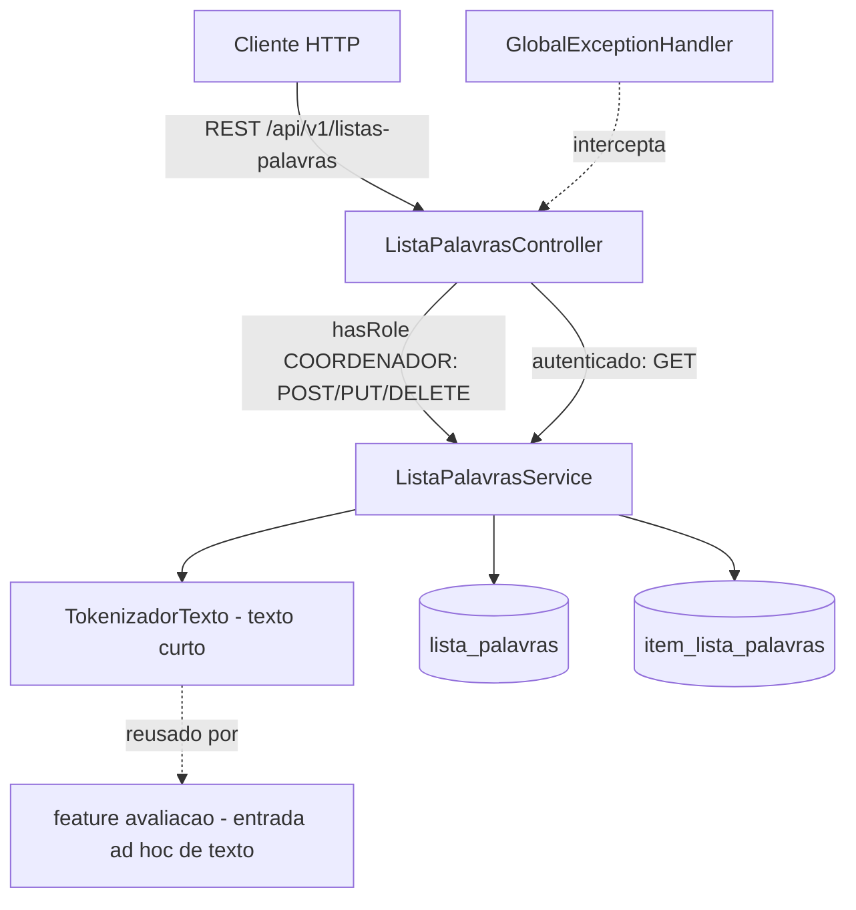

# Banco de Palavras Design

**Spec**: `.specs/features/banco-palavras/spec.md`
**Status**: Approved

---

## Architecture Overview

Mesma arquitetura em camadas do resto do backend (Controller → Service → Repository → Entity/JPA), num novo pacote `bancopalavras` irmão de `cadastros` e `autenticacao`. A escrita (`POST`/`PUT`/`DELETE`) é restrita a `COORDENADOR` via `@PreAuthorize`, igual ao padrão já usado em `AlunoController`/`ProfessorController` desde `autenticacao-perfis`. A leitura (`GET`) fica aberta a qualquer usuário autenticado (`COORDENADOR` e `PROFESSOR`), sem escopo por professor — a spec não pede filtro de "dono" aqui, diferente de `cadastros.aluno`.

Não há porta nova: a feature não depende de nada que ainda não exista (ao contrário de `cadastros-base`, que precisou de `HistoricoAvaliacaoPort`/`ContextoUsuarioPort` provisórios). `banco-palavras` só consome infraestrutura já pronta (`common.error`, Spring Security).



---

## Code Reuse Analysis

### Existing Components to Leverage

| Component | Location | How to Use |
| --- | --- | --- |
| `BusinessException` / `GlobalExceptionHandler` | `common/error/` | Erros de negócio (`NAO_CANONICA_PROIBIDA_1_ANO`, `PALAVRA_DUPLICADA`, `CONTEUDO_INCOMPATIVEL_COM_TIPO`) viram `ProblemDetail` 422; `@Version` + `ObjectOptimisticLockingFailureException` já mapeado para 409 `CONFLITO_DE_VERSAO` (PUT em lista) |
| `@PreAuthorize("hasRole('COORDENADOR')")` | padrão em `AlunoController`/`ProfessorController`/`TurmaController` (pós `autenticacao-perfis`) | Mesma anotação nos 3 endpoints de escrita; GET sem anotação = qualquer autenticado |
| Padrão DTO (records + `from(...)` estático) | `cadastros.*.dto` | Mesmo padrão para os DTOs desta feature |
| Padrão de migração Flyway (`V{n}__nome.sql`) | `src/main/resources/db/migration/` | Próxima migração é `V6__banco_palavras.sql` (`V5__usuario.sql` é a última) |
| Soft-delete via `ativo BOOLEAN` (RNF006) | `cadastros.professor.Professor`, `cadastros.turma.Turma` | `DELETE /listas-palavras/{id}` faz `UPDATE ativo=false`, nunca `DELETE FROM` |

### Rejeitado: FK para `cadastros.dominio.TipoLeitura`

A tabela `tipo_leitura` (seed fixo, `GET /api/v1/tipos-leitura`) já existe e cobre os mesmos três códigos (`PALAVRA`, `PSEUDOPALAVRA`, `TEXTO_CURTO`). Cogitei referenciar `lista_palavras.tipo_leitura_id → tipo_leitura(id)` para não duplicar o domínio. Optei por **não** reusar: o precedente mais próximo no próprio código (`usuario.perfil`, `V5__usuario.sql`) já resolve um enum fixo pequeno como coluna `ENUM(...)` nativa, sem tabela de apoio, e isso evita um `JOIN`/lookup só para filtrar `GET /listas-palavras?tipoLeitura=`. Ver Risks & Concerns para o trade-off.

### Integration Points

| System | Integration Method |
| --- | --- |
| MySQL | Nova migração Flyway `V6__banco_palavras.sql` (tabelas `lista_palavras`, `item_lista_palavras`) |
| Spring Security | `@PreAuthorize` nos 3 endpoints de escrita, igual às demais features pós `autenticacao-perfis` |
| `avaliacao` (futura) | Vai reusar `bancopalavras.TokenizadorTexto.tokenizar(String)` para a entrada ad hoc de texto (fora do escopo desta feature, mas a função é pública e pura para isso) |

---

## Components

### `bancopalavras` — ListaPalavrasController

- **Purpose**: Expor os 4 endpoints REST da feature.
- **Location**: `src/main/java/com/missio/fluencia_leitora/bancopalavras/ListaPalavrasController.java`
- **Interfaces**:
  - `POST /api/v1/listas-palavras` `@PreAuthorize("hasRole('COORDENADOR')")` → `ListaPalavrasService.criar(CriarListaPalavrasRequest): ListaPalavras`, 201
  - `PUT /api/v1/listas-palavras/{id}` `@PreAuthorize("hasRole('COORDENADOR')")` → `ListaPalavrasService.atualizar(Long, AtualizarListaPalavrasRequest): ListaPalavras` (mesmas validações da criação; não toca em avaliações já criadas — PAL-06)
  - `DELETE /api/v1/listas-palavras/{id}` `@PreAuthorize("hasRole('COORDENADOR')")` → `ListaPalavrasService.inativar(Long)`, soft-delete (`ativo=false`)
  - `GET /api/v1/listas-palavras?serie={s}&tipoLeitura={t}` (sem `@PreAuthorize`, qualquer autenticado) → `ListaPalavrasService.buscar(int serie, TipoLeituraCodigo tipo): List<ListaPalavrasResumo>` — só `ativo=true`
  - `GET /api/v1/listas-palavras/{id}` (sem `@PreAuthorize`) → `ListaPalavrasService.buscarPorId(Long): ListaPalavras` — inclui inativas (PAL-11: "mantê-la acessível por id")
- **Dependencies**: `ListaPalavrasService`
- **Reuses**: nenhum port novo; `@PreAuthorize` já configurado globalmente pela feature `autenticacao-perfis`

### `bancopalavras` — ListaPalavrasService

- **Purpose**: Validações cruzadas (formato, duplicidade, série×canônica, compatibilidade conteúdo×tipo), tokenização de texto curto, orquestração transacional.
- **Location**: `src/main/java/com/missio/fluencia_leitora/bancopalavras/ListaPalavrasService.java`
- **Interfaces**:
  - `criar(CriarListaPalavrasRequest req): ListaPalavras` — `@Transactional`; valida, monta `ListaPalavras` + `List<ItemListaPalavras>`, salva
  - `atualizar(Long id, AtualizarListaPalavrasRequest req): ListaPalavras` — `@Transactional`; mesmas validações; substitui a coleção de itens (`orphanRemoval`); depende do `@Version` do request para detectar edição concorrente
  - `inativar(Long id): void`
  - `buscar(int serie, TipoLeituraCodigo tipo): List<ListaPalavrasResumoProjection>`
  - `buscarPorId(Long id): ListaPalavras`
  - (privado) `validarConteudo(...)`, `validarSerieCanonica(...)`, `validarDuplicidade(...)` — cada um lança `BusinessException` com o `code` do AC correspondente
- **Dependencies**: `ListaPalavrasRepository`, `TokenizadorTexto`
- **Reuses**: `common.error.BusinessException`

### `common.texto` — TokenizadorTexto

- **Purpose**: Função pura que separa um texto corrido em palavras (PAL-08), reutilizável por `banco-palavras` (cadastro de `TEXTO_CURTO`) e, depois, pela feature `avaliacao` (entrada ad hoc — Success Criteria do spec).
- **Location**: `src/main/java/com/missio/fluencia_leitora/common/texto/TokenizadorTexto.java`
- **Interfaces**:
  - `static List<String> tokenizar(String texto)` — separa por espaços em branco, remove pontuação do início/fim de cada token, descarta tokens vazios (AC PAL-08); sem estado, sem I/O
- **Dependencies**: nenhuma
- **Reuses**: N/A — colocada em `common` justamente para ser importável por `avaliacao` sem essa feature depender do pacote `bancopalavras`

### `bancopalavras` — ListaPalavrasRepository

- **Purpose**: Persistência + query de filtro sem N+1.
- **Location**: `src/main/java/com/missio/fluencia_leitora/bancopalavras/ListaPalavrasRepository.java`
- **Interfaces**:
  - `extends JpaRepository<ListaPalavras, Long>`
  - `@Query("select l.id as id, l.nome as nome, count(i) as quantidadePalavras from ListaPalavras l join l.itens i where l.serie = :serie and l.tipoLeitura = :tipo and l.ativo = true group by l.id, l.nome") List<ListaPalavrasResumoProjection> buscarResumo(int serie, TipoLeituraCodigo tipo)` — projeção de interface Spring Data, evita carregar a coleção `itens` inteira por lista só para contar
- **Dependencies**: nenhuma
- **Reuses**: N/A

---

## Data Models

```java
enum TipoLeituraCodigo { PALAVRA, PSEUDOPALAVRA, TEXTO_CURTO } // espelha cadastros.dominio.TipoLeitura.codigo, ver Risks & Concerns
enum TipoPalavra { CANONICA, NAO_CANONICA }

class ListaPalavras {
    Long id;
    String nome;                  // 3-100
    int serie;                    // 1-5
    TipoLeituraCodigo tipoLeitura;
    TipoPalavra tipoPalavra;      // NULL para PALAVRA/PSEUDOPALAVRA (é por item); obrigatório para TEXTO_CURTO
    String texto;                 // NULL exceto para TEXTO_CURTO (1-2000 chars, grafia original preservada)
    boolean ativo;                // soft-delete (RNF006), nunca DELETE FROM
    List<ItemListaPalavras> itens; // @OrderBy("ordem"), cascade=ALL, orphanRemoval=true
    Long version;                 // lock otimista -> 409 CONFLITO_DE_VERSAO
    Instant criadoEm;
    Instant atualizadoEm;
}

class ItemListaPalavras {
    Long id;
    ListaPalavras lista;          // FK
    String palavra;               // <=60 chars, letras (unicode, com acento) e hífen; trim aplicado, grafia original preservada
    TipoPalavra tipoPalavra;      // por item (PALAVRA/PSEUDOPALAVRA) OU copiado do tipoPalavra da lista (tokens de TEXTO_CURTO)
    int ordem;                    // 1..n, unique com lista
}
```

**Relacionamentos**: `ListaPalavras 1—N ItemListaPalavras` (agregado único; `ItemListaPalavras` só existe dentro do ciclo de vida de uma `ListaPalavras`, sem repositório próprio). `Avaliacao` (feature futura) copia palavras da lista no momento da criação (PAL-06) — não há FK de `avaliacao` para `item_lista_palavras`; é uma cópia de valor, coerente com o padrão já usado em `Matricula`→`Avaliacao` (AD-005).

**Migração** `V6__banco_palavras.sql`:

```sql
CREATE TABLE lista_palavras (
    id BIGINT AUTO_INCREMENT PRIMARY KEY,
    nome VARCHAR(100) NOT NULL,
    serie TINYINT NOT NULL,
    tipo_leitura ENUM('PALAVRA','PSEUDOPALAVRA','TEXTO_CURTO') NOT NULL,
    tipo_palavra ENUM('CANONICA','NAO_CANONICA') NULL,
    texto VARCHAR(2000) NULL,
    ativo BOOLEAN NOT NULL DEFAULT TRUE,
    version BIGINT NOT NULL DEFAULT 0,
    criado_em TIMESTAMP NOT NULL DEFAULT CURRENT_TIMESTAMP,
    atualizado_em TIMESTAMP NOT NULL DEFAULT CURRENT_TIMESTAMP
        ON UPDATE CURRENT_TIMESTAMP,

    CONSTRAINT ck_lista_palavras_serie CHECK (serie BETWEEN 1 AND 5)
);

CREATE INDEX idx_lista_palavras_filtro ON lista_palavras (serie, tipo_leitura, ativo);

CREATE TABLE item_lista_palavras (
    id BIGINT AUTO_INCREMENT PRIMARY KEY,
    lista_palavras_id BIGINT NOT NULL,
    palavra VARCHAR(60) NOT NULL,
    tipo_palavra ENUM('CANONICA','NAO_CANONICA') NOT NULL,
    ordem INT NOT NULL,

    CONSTRAINT fk_item_lista_palavras_lista
        FOREIGN KEY (lista_palavras_id) REFERENCES lista_palavras(id),

    CONSTRAINT uk_item_lista_palavras_ordem UNIQUE (lista_palavras_id, ordem)
);
```

Sem constraint de unicidade de `palavra` no banco: a checagem de duplicidade (PAL-04) compara só os itens do próprio payload de uma requisição (a lista inteira é criada/substituída numa única chamada, nunca item a item), então validação em memória no service basta — não há corrida concorrente a proteger.

---

## Error Handling Strategy

| Error Scenario | Handling | User Impact |
| --- | --- | --- |
| `nome`/`serie`/`palavra` fora do formato básico (`@Valid` em `CriarListaPalavrasRequest`/`ItemPalavraRequest`) | `GlobalExceptionHandler.handleMethodArgumentNotValid` (já existe) | 422 com lista de `{field, message}`; para itens de uma lista, o `field` do Spring já vem como `itens[2].palavra`, expondo a posição sem código extra |
| `serie=1` com item/texto `NAO_CANONICA` | `BusinessException` com `code=NAO_CANONICA_PROIBIDA_1_ANO` + `details={posicoes:[...]}` (ver Tech Decisions) | 422 com `code` e a lista de posições inválidas |
| Palavra repetida (case-insensitive, após trim) em lista `PALAVRA`/`PSEUDOPALAVRA` | `BusinessException(422, "PALAVRA_DUPLICADA", ...)` | 422 com `code` |
| `itens` enviado para `TEXTO_CURTO` (ou `texto`/`tipoPalavra` enviado para `PALAVRA`/`PSEUDOPALAVRA`) | `BusinessException(422, "CONTEUDO_INCOMPATIVEL_COM_TIPO", ...)` | 422 com `code` |
| Texto gera mais de 200 tokens | `BusinessException(422, "VALIDACAO_INVALIDA", ...)` | 422 com `code` |
| Edição concorrente da mesma lista (`PUT`) | `ObjectOptimisticLockingFailureException` → handler já existente | 409 `CONFLITO_DE_VERSAO` |
| `GET /listas-palavras/{id}` para id inexistente | `BusinessException(404, "LISTA_NAO_ENCONTRADA", ...)` | 404 |

---

## Risks & Concerns

| Concern | Location (file:line) | Impact | Mitigation |
| --- | --- | --- | --- |
| `TipoLeituraCodigo` (enum novo) duplica os códigos que já existem em `tipo_leitura` (seed, `V1__dominios_fixos.sql`) | `bancopalavras.TipoLeituraCodigo` (novo) | Se algum dia um `tipo_leitura` novo for adicionado só na tabela (via UPDATE manual, por exemplo), o enum Java fica dessincronizado e `GET /listas-palavras?tipoLeitura=` não reconhece o novo valor | `tipo_leitura` é seed fixo sem endpoint de escrita (`DominioFixoController` só tem GET, confirmado em `cadastros-base`); risco de drift é baixo. Se a feature `regras-classificacao` ou outra precisar de um 4º tipo de leitura no futuro, os dois pontos (migração + enum) precisam mudar juntos — deixar isso documentado aqui é a mitigação |
| Validação cruzada (`itens` vs `texto` vs `tipoPalavra` da lista, conforme `tipoLeitura`) só existe no `ListaPalavrasService`, sem constraint no banco que impeça uma linha inconsistente | `bancopalavras.ListaPalavrasService` (novo) | Um bug futuro no service poderia gravar uma `TEXTO_CURTO` sem `texto`, por exemplo | Coberto por teste de unidade para cada combinação do AC "Edge Cases" (PAL-12); AD-007 exige 85% de cobertura de linha, então o gate de build já força esses caminhos a serem testados |
| `GET /listas-palavras` sem paginação | `bancopalavras.ListaPalavrasController` (novo) | Uma escola com muitas listas por série/tipo devolveria tudo de uma vez | Fora de escopo pela spec (não pede paginação aqui, ao contrário de `GET /alunos`); o volume esperado por `serie`+`tipoLeitura` é pequeno (dezenas, não milhares) — não vale a complexidade agora |

> Nenhum problema de código existente encontrado nas áreas tocadas (pacotes `common.error` e `common.security` já são só consumidos, não alterados em comportamento).

---

## Tech Decisions

| Decision | Choice | Rationale |
| --- | --- | --- |
| `tipo_leitura` em `lista_palavras` | Coluna `ENUM` nativa + enum Java `TipoLeituraCodigo`, não FK para `tipo_leitura` | Segue o precedente local mais recente (`usuario.perfil`, `V5`); evita join só para filtrar a listagem. Trade-off documentado em Risks & Concerns |
| `tipoPalavra` no nível da lista vs no item | Coluna em `ListaPalavras` (nullable, só para `TEXTO_CURTO`) **e** coluna em `ItemListaPalavras` (not-null, preenchida por item nos outros dois tipos, copiada do valor da lista nos tokens de texto) | Resolve a assumption do spec ("Tipo das palavras de um texto curto: informado uma vez") mantendo `ItemListaPalavras` uniforme — todo item sempre tem um `tipoPalavra`, então o validador `NAO_CANONICA_PROIBIDA_1_ANO` e a leitura por `avaliacao` não precisam de dois caminhos diferentes |
| Erro de negócio com dado estruturado extra (posições inválidas) | Novo construtor `BusinessException(HttpStatus, String code, String message, Map<String,Object> details)`; `GlobalExceptionHandler` copia cada entrada de `details` como `problemDetail.setProperty(...)`, além do `code` | Único AC da feature que exige dado estruturado além do `code` (`NAO_CANONICA_PROIBIDA_1_ANO` pede as posições dos itens inválidos). Construtor antigo continua existindo (overload), nenhuma feature anterior quebra. **Isso é uma extensão de um componente compartilhado (`common.error`) — promovido a `AD-008` em `STATE.md`** |
| Duplicidade de itens | Checada em memória no service, não por constraint no banco | A lista inteira é criada/substituída numa única chamada; não há gravação item a item que precise de proteção concorrente (ver Data Models) |
| Contagem de `quantidadePalavras` no `GET` filtrado | Projeção Spring Data (`COUNT` + `GROUP BY` via JPQL), não `itens.size()` após carregar a entidade | Evita N+1 / carregar a coleção inteira de itens só para contar, ao listar várias listas de uma vez |

> **AD-008 registrada em `STATE.md`**: extensão de `BusinessException` com `details` estruturados, convenção para toda feature futura que precise devolver mais que um `code` num erro 422/409.
