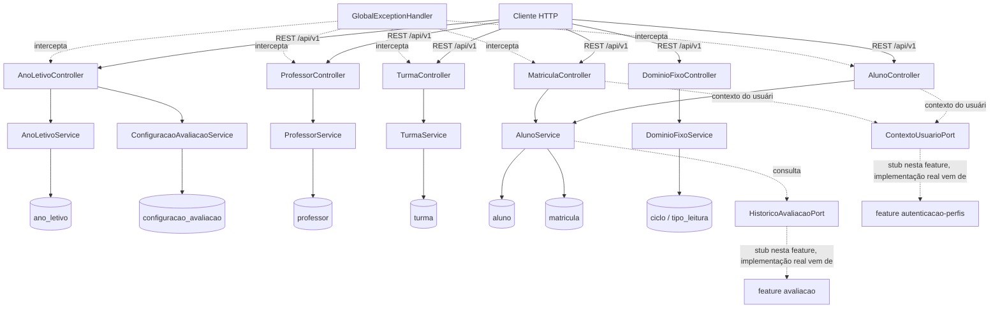

# Cadastros Base Design

**Spec**: `.specs/features/cadastros-base/spec.md`
**Status**: Approved

---

## Architecture Overview

Camadas clássicas Spring Boot (Controller → Service → Repository → Entity/JPA), organizadas por agregado dentro de um pacote `cadastros`. Cada agregado tem seu próprio sub-pacote com `controller`, `service`, `repository`, `entity` e `dto`. Um pacote `common` concentra o que é transversal a todas as features futuras (tratamento de erro RFC 7807, paginação, contexto do usuário autenticado).



---

## Code Reuse Analysis

### Existing Components to Leverage

Repositório greenfield: só existe o esqueleto padrão do Spring Initializr (`FluenciaLeitoraApplication`, `application.yaml` vazio, dependências JPA/Flyway/Validation/WebMVC/Lombok já no `pom.xml`). Nada de domínio para reaproveitar. `cadastros-base` é a primeira feature implementada e define os padrões (pacotes, tratamento de erro, migrações) que as outras 7 features vão seguir.

### Integration Points

| System | Integration Method |
| ------ | ------------------- |
| MySQL | Flyway (`src/main/resources/db/migration`), driver `mysql-connector-j` a adicionar ao `pom.xml` (ainda não está lá) |
| Testcontainers | A adicionar ao `pom.xml` (`testcontainers-mysql`, `testcontainers-junit-jupiter`) - AD-007 exige MySQL real nos testes de integração |
| `autenticacao-perfis` (futura) | Consome `ContextoUsuarioPort`; até lá, um adapter provisório lê headers HTTP |
| `avaliacao` (futura) | Implementa `HistoricoAvaliacaoPort`; até lá, um adapter provisório sempre retorna "sem avaliação" |

---

## Components

### `common.error` — GlobalExceptionHandler

- **Purpose**: Converter exceções em `ProblemDetail` (RFC 7807) com o campo de extensão `code`, no formato dos códigos do spec (`ANO_LETIVO_DUPLICADO`, `TURMA_DUPLICADA`, etc.).
- **Location**: `src/main/java/com/missio/fluencia_leitora/common/error/`
- **Interfaces**:
  - `GlobalExceptionHandler` (`@RestControllerAdvice extends ResponseEntityExceptionHandler`)
    - trata `BusinessException` → status/código da própria exceção
    - sobrescreve `handleMethodArgumentNotValid` → 422 (o padrão do Spring é 400; o spec exige 422 para toda validação de payload)
    - trata `ObjectOptimisticLockingFailureException` → 409 `CONFLITO_DE_VERSAO`
  - `BusinessException(HttpStatus status, String code, String message)` — `RuntimeException` genérica para regras de negócio (409/422 com código do domínio)
- **Dependencies**: nenhuma
- **Reuses**: N/A (componente novo, será reusado por todas as outras features)

### `common.security` — ContextoUsuarioPort

- **Purpose**: Abstrair "quem está chamando a API" (perfil COORDENADOR/PROFESSOR e, se professor, seu `professorId`) sem acoplar `cadastros-base` à feature `autenticacao-perfis`, que ainda não existe.
- **Location**: `src/main/java/com/missio/fluencia_leitora/common/security/`
- **Interfaces**:
  - `ContextoUsuarioPort { Perfil perfilAtual(); Long professorIdAtual(); }`
  - `ContextoUsuarioHeaderAdapter implements ContextoUsuarioPort` — lê os headers `X-Perfil` e `X-Professor-Id` da requisição (via `HttpServletRequest`); **provisório**, documentado como tal em javadoc. `autenticacao-perfis` substitui este bean por um que lê o token/sessão real; a interface não muda.
- **Dependencies**: `HttpServletRequest` (request-scoped)
- **Reuses**: N/A

### `cadastros.anoletivo` — AnoLetivoController / AnoLetivoService / ConfiguracaoAvaliacaoService

- **Purpose**: CRUD de ano letivo (com seed automático das 5 configurações de série) e edição dos limites por série.
- **Location**: `src/main/java/com/missio/fluencia_leitora/cadastros/anoletivo/`
- **Interfaces**:
  - `POST /api/v1/anos-letivos` → `AnoLetivoService.criar(CriarAnoLetivoRequest): AnoLetivoResponse` (cria o ano + as 5 linhas de `configuracao_avaliacao` na mesma transação)
  - `POST /api/v1/anos-letivos/{id}/ativar` → `AnoLetivoService.ativar(Long id)` (encerra o `ATIVO` anterior, se houver, e ativa o novo — transacional)
  - `PUT /api/v1/anos-letivos/{id}/configuracoes/{serie}` → `ConfiguracaoAvaliacaoService.atualizar(Long anoLetivoId, int serie, AtualizarConfiguracaoRequest)`
  - `DELETE /api/v1/anos-letivos/{id}` → `AnoLetivoService.inativar(Long id)`, seta `ativo=false` (soft-delete, RNF006/CAD-19) sem tocar em `situacao`
- **Dependencies**: `AnoLetivoRepository`, `ConfiguracaoAvaliacaoRepository`
- **Reuses**: `common.error.BusinessException`

### `cadastros.professor` — ProfessorController / ProfessorService

- **Purpose**: CRUD de professor e consulta com as turmas ativas associadas.
- **Location**: `src/main/java/com/missio/fluencia_leitora/cadastros/professor/`
- **Interfaces**:
  - `POST /api/v1/professores`
  - `GET /api/v1/professores/{id}` → inclui `List<TurmaResumo>` das turmas ativas (query em `TurmaRepository`)
  - `DELETE /api/v1/professores/{id}` → inativa; bloqueia com 409 `PROFESSOR_COM_TURMA_ATIVA` se houver turma ativa vinculada
- **Dependencies**: `ProfessorRepository`, `TurmaRepository`
- **Reuses**: `common.error.BusinessException`

### `cadastros.turma` — TurmaController / TurmaService

- **Purpose**: CRUD de turma, vínculo com professor e ano letivo.
- **Location**: `src/main/java/com/missio/fluencia_leitora/cadastros/turma/`
- **Interfaces**:
  - `POST /api/v1/turmas`
  - `PUT /api/v1/turmas/{id}` (troca de professor responsável — não afeta avaliações, que guardam cópia própria)
  - `DELETE /api/v1/turmas/{id}` → inativa
- **Dependencies**: `TurmaRepository`, `ProfessorRepository`, `AnoLetivoRepository`
- **Reuses**: `common.error.BusinessException`

### `cadastros.aluno` — AlunoController / AlunoService / MatriculaService

- **Purpose**: Cadastro de aluno + primeira matrícula (transação única), novas matrículas em outros anos, busca por nome, alteração de professor/turma da matrícula, indicador de ano finalizado, bloqueio de troca de nome.
- **Location**: `src/main/java/com/missio/fluencia_leitora/cadastros/aluno/`
- **Interfaces**:
  - `POST /api/v1/alunos` → `AlunoService.criarComMatricula(CriarAlunoRequest)` (cria `Aluno` + `Matricula` na mesma transação — CAD-11)
  - `POST /api/v1/alunos/{alunoId}/matriculas` → `MatriculaService.matricular(Long alunoId, NovaMatriculaRequest)`
  - `GET /api/v1/alunos?nome={termo}&page=` → `AlunoService.buscar(String termo, Pageable, ContextoUsuarioPort)` — filtra por `professorId` da matrícula ativa quando o perfil é PROFESSOR (CAD-16)
  - `PUT /api/v1/alunos/{id}` → bloqueia mudança de `nome` com 409 `ALUNO_COM_AVALIACAO` quando `HistoricoAvaliacaoPort.existeAvaliacaoNaoCancelada(alunoId)` for `true`
  - `DELETE /api/v1/alunos/{id}` → `AlunoService.inativar(Long id)`, seta `ativo=false` (soft-delete, RNF006/CAD-19)
  - `PATCH /api/v1/matriculas/{id}` → troca de professor/turma/`anoFinalizado`
- **Dependencies**: `AlunoRepository`, `MatriculaRepository`, `TurmaRepository`, `HistoricoAvaliacaoPort`, `ContextoUsuarioPort`
- **Reuses**: `common.error.BusinessException`, `common.security.ContextoUsuarioPort`

### `cadastros.aluno` — HistoricoAvaliacaoPort

- **Purpose**: Perguntar "esse aluno tem avaliação com status diferente de CANCELADA?" sem `cadastros-base` depender da tabela `avaliacao`, que pertence à feature `avaliacao` (ainda não implementada).
- **Location**: `src/main/java/com/missio/fluencia_leitora/cadastros/aluno/HistoricoAvaliacaoPort.java`
- **Interfaces**:
  - `HistoricoAvaliacaoPort { boolean existeAvaliacaoNaoCancelada(Long alunoId); }`
  - `HistoricoAvaliacaoPortStub implements HistoricoAvaliacaoPort` — sempre retorna `false` (não há avaliações possíveis enquanto a feature `avaliacao` não existir). Javadoc explica que a feature `avaliacao` deve fornecer um `@Primary` bean real que consulta sua própria tabela.
- **Dependencies**: nenhuma
- **Reuses**: N/A

### `cadastros.dominio` — DominioFixoController

- **Purpose**: Expor `ciclo` e `tipo_leitura` (somente leitura, seed via Flyway).
- **Location**: `src/main/java/com/missio/fluencia_leitora/cadastros/dominio/`
- **Interfaces**:
  - `GET /api/v1/ciclos`
  - `GET /api/v1/tipos-leitura`
  - Sem `POST`/`PUT`/`DELETE` — qualquer verbo de escrita nesses paths retorna 405 (nenhum `@RequestMapping` os expõe; o 405 é o comportamento padrão do Spring quando o path existe para GET mas não para o verbo chamado)
- **Dependencies**: `CicloRepository`, `TipoLeituraRepository`
- **Reuses**: N/A

---

## Data Models

Desvio deliberado do DDL do SDD §19, conforme AD-005 (split `aluno`/`matricula`) e necessidade de `situacao` no ano letivo (ver Tech Decisions).

```java
enum SituacaoAnoLetivo { PLANEJADO, ATIVO, ENCERRADO }

class AnoLetivo {
    Long id;
    int ano;                 // unique
    LocalDate dataInicio;
    LocalDate dataFim;
    SituacaoAnoLetivo situacao;  // ciclo de vida do negócio: PLANEJADO -> ATIVO -> ENCERRADO
    boolean ativo;                // soft-delete (RNF006), independente de `situacao`
    Long version;
    Instant criadoEm;
    Instant atualizadoEm;
}

class ConfiguracaoAvaliacao {
    Long id;
    AnoLetivo anoLetivo;      // FK
    int serie;                // 1..5, unique com anoLetivo
    int quantidadeMinima;
    int quantidadeMaxima;
    Long version;
}

class Professor {
    Long id;
    String nome;
    boolean ativo;
    Long version;
    Instant criadoEm;
    Instant atualizadoEm;
}

class Turma {
    Long id;
    String nome;              // unique (case-insensitive) por anoLetivo
    int serie;
    AnoLetivo anoLetivo;      // FK
    Professor professor;      // FK, nullable
    boolean ativo;
    Long version;
}

class Aluno {
    Long id;
    String nome;              // bloqueado após avaliação não cancelada
    boolean ativo;
    Long version;
    Instant criadoEm;
}

class Matricula {
    Long id;
    Aluno aluno;              // FK
    AnoLetivo anoLetivo;      // FK, unique com aluno
    Turma turma;              // FK
    int serie;                // cópia da turma no momento da matrícula
    Professor professor;      // FK, cópia do professor da turma no momento da matrícula
    boolean anoFinalizado;
    Long version;
}

// Somente leitura, seed via Flyway
class Ciclo { Long id; String codigo; String descricao; }
class TipoLeitura { Long id; String codigo; String descricao; }
```

**Relacionamentos**: `AnoLetivo 1—N ConfiguracaoAvaliacao`, `AnoLetivo 1—N Turma`, `AnoLetivo 1—N Matricula`, `Professor 1—N Turma`, `Professor 1—N Matricula`, `Turma 1—N Matricula`, `Aluno 1—N Matricula` (uma linha por ano letivo, `AD-005`). `Avaliacao` (feature futura) referenciará `Aluno` diretamente, não `Matricula` (AD-005 já registra que `Avaliacao` guarda cópia de turma/série/professor).

---

## Error Handling Strategy

| Error Scenario | Handling | User Impact |
| --- | --- | --- |
| Regra de negócio violada (duplicidade, referência inválida, transição inválida) | `BusinessException` com `HttpStatus` + `code` específico → `GlobalExceptionHandler` | `ProblemDetail` 409/422 com `code` (ex.: `TURMA_DUPLICADA`) |
| Payload inválido (`@Valid` falhou) | `handleMethodArgumentNotValid` sobrescrito | `ProblemDetail` 422 com lista de campos inválidos |
| Escrita concorrente no mesmo registro | `ObjectOptimisticLockingFailureException` (do `@Version`) mapeada no handler | `ProblemDetail` 409 `CONFLITO_DE_VERSAO` |
| Verbo não suportado num path só de leitura (`ciclos`, `tipos-leitura`) | Comportamento padrão do Spring (nenhum handler registrado para o verbo) | 405, sem corpo customizado (spec não exige corpo específico) |

---

## Risks & Concerns

| Concern | Location (file:line) | Impact | Mitigation |
| --- | --- | --- | --- |
| CAD-15 depende de dados de `avaliacao`, feature ainda não implementada | `cadastros.aluno.HistoricoAvaliacaoPort` (novo) | Sem essa dependência resolvida, a regra "nome bloqueado após avaliação" não tem como consultar avaliações reais | Port + stub que sempre retorna `false`; a regra de bloqueio é testada no nível de serviço com um mock do port (não depende da tabela existir); feature `avaliacao` troca o bean por um `@Primary` real |
| CAD-16 (busca escopada ao professor) depende de "quem está logado", que só existe na feature `autenticacao-perfis` | `common.security.ContextoUsuarioPort` (novo) | Sem isso, não há como testar o filtro por professor nem aplicar a restrição de escrita "só COORDENADOR" | Port + adapter provisório por headers HTTP (`X-Perfil`, `X-Professor-Id`), documentado como temporário; `autenticacao-perfis` substitui o adapter sem mudar quem o consome. **A restrição "só COORDENADOR escreve" não é reforçada nesta feature** (fora do escopo de `cadastros-base`, confirmado pelo próprio spec) |
| Busca por nome "sem diferenciar maiúsculas nem acentos" (CAD-16) — a collation `utf8mb4_unicode_ci` do banco (SDD §19, nível database) é *accent-sensitive* (confirmado via pesquisa; `é` ≠ `e`) | migração Flyway, tabela `aluno` | `LIKE`/`CONTAINS` com essa collation não ignora acento; a busca falharia o AC | Definir a coluna `aluno.nome` (e seu índice) com `COLLATE utf8mb4_0900_ai_ci` (accent + case insensitive no MySQL 8), sobrescrevendo a collation padrão do banco só nessa coluna; desvio pontual e documentado do DDL do SDD |
| `mysql-connector-j`, `spring-boot-starter-security` (se necessário) e Testcontainers ainda não estão no `pom.xml` | `pom.xml` | Build falha sem essas dependências | Primeira tarefa da fase de Tasks: adicionar as dependências antes de qualquer entidade/teste |
| Nenhum índice definido ainda para as FKs e para a busca por `aluno.nome` | migração Flyway | Buscas e joins lentos conforme a base cresce | Migração inclui índices explícitos nas FKs e um índice funcional/normal em `aluno.nome` |

---

## Tech Decisions

| Decision | Choice | Rationale |
| --- | --- | --- |
| Situação do ano letivo | `enum SituacaoAnoLetivo { PLANEJADO, ATIVO, ENCERRADO }` **além de** um `ativo BOOLEAN` próprio (soft-delete) | Assumption já resolvida na spec (linha 33): o booleano do DDL não diferencia planejado de encerrado, e CAD-04 exige "só um ATIVO por vez". Mas o edge case de DELETE (spec linha 138) se aplica a ano letivo também, e "inativar por exclusão" é um eixo diferente do ciclo de vida do negócio — por isso os dois campos coexistem |
| Cross-feature antes da dependência existir | Port + adapter provisório (`HistoricoAvaliacaoPort`, `ContextoUsuarioPort`) | Mesmo padrão já usado em AD-003 (porta de armazenamento de áudio); evita acoplar `cadastros-base` a features que ainda não existem, sem deixar a regra de negócio sem teste |
| Autenticação provisória | Headers HTTP `X-Perfil` / `X-Professor-Id`, lidos por `ContextoUsuarioHeaderAdapter` | Permite testar CAD-16 (escopo por professor) agora; `autenticacao-perfis` substitui o adapter, a interface não muda |
| Mapeamento DTO ↔ entidade | Records Java + método estático `from(...)` na própria DTO, sem MapStruct | Poucos campos por entidade; uma dependência nova (MapStruct) não se paga para este volume de mapeamento |
| Erro de payload inválido | 422 em vez do 400 padrão do Spring para `@Valid` | AD-006 fixa RFC 7807 para erros; o spec exige 422 explicitamente em várias ACs (ex.: CAD-03, CAD-06) |
| Collation da busca por nome | `utf8mb4_0900_ai_ci` na coluna `aluno.nome`, banco continua `utf8mb4_unicode_ci` (SDD §19) | Único jeito confirmado de obter accent-insensitive no MySQL 8 sem normalizar o texto na aplicação |
| Exclusão | Nenhum `@Repository.delete(...)` chamado pelos services de `cadastros-base`; todo "DELETE" é um `UPDATE ... SET ativo=false` | RNF006 e CAD-19 (spec linha 138-139) |

> Nenhuma decisão acima estabelece uma convenção nova de projeto que precise virar `AD-NNN` além do padrão de port/adapter, que já está coberto por AD-003. Padrão de erro RFC 7807 e o corte por camadas já estão em AD-006.
