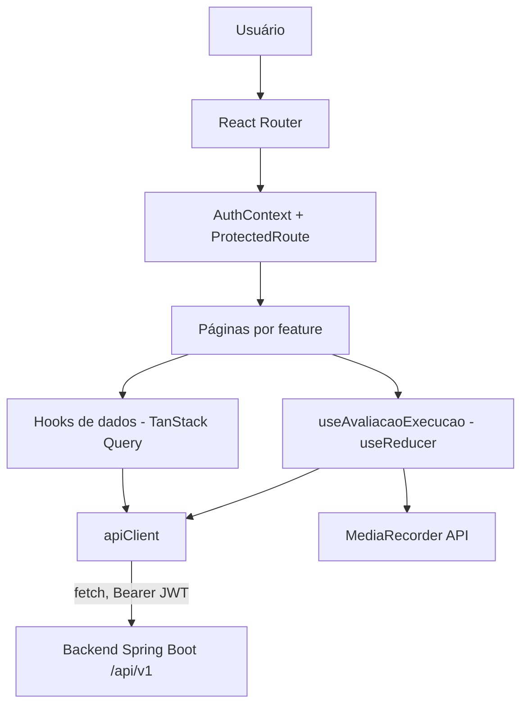

# Frontend Web Design

**Spec**: `.specs/features/frontend-web/spec.md`
**Context**: `.specs/features/frontend-web/context.md`
**Status**: Approved

---

## Architecture Overview

SPA React + TypeScript + Vite em `frontend/` (novo diretório, raiz do repositório, ao lado de `src/`). Roteamento com `react-router-dom`; estado de servidor com TanStack Query (`@tanstack/react-query`); sessão (token/perfil) em `AuthContext` (Context API); cronômetro e gravação em `useReducer` local à tela de execução. Um único cliente HTTP (`apiClient`) centraliza base URL, header `Authorization`, parsing do erro RFC 7807 e o redirecionamento em 401 (FE-03). Em dev, o Vite faz proxy de `/api` para o backend (`http://localhost:8080`), evitando CORS sem tocar no `SecurityConfig` do backend (context.md, "CORS / integração dev").



### Estrutura de pastas (`frontend/src/`)

```
src/
  app/               # App.tsx, router, ProtectedRoute, QueryClientProvider
  auth/              # AuthContext, useAuth, LoginPage
  api/               # apiClient.ts, tipos TS espelhando os DTOs do backend, hooks por domínio
  features/
    alunos/          # busca + resumo (P1)
    avaliacoes/       # configurar, executar, resultado (P1)
    historico/        # histórico + evolução por ciclo + comparação anual (P1)
    cadastros/         # anos-letivos, turmas, professores, alunos, usuários, regras, listas (P2)
  components/        # componentes de UI compartilhados (StatusPalavraBadge, Cronometro, Tabela, etc.)
  layout/            # AppLayout, menu por perfil (FE-04)
  test/               # setup do Vitest/RTL, mocks de MediaRecorder/getUserMedia
e2e/                  # specs Playwright (fora de src/, roda contra o build/dev server)
```

Cada subpasta de `features/[nome]/` segue o mesmo padrão: `[Nome]Page.tsx` (composição), `use[Nome].ts` (hooks TanStack Query específicos do domínio, quando não cabem em `api/`), e o teste co-localizado (`*.test.tsx`).

---

## Code Reuse Analysis

### Integration Points (contratos já implementados no backend — fonte da verdade para os tipos TS)

| Domínio | Endpoints consumidos | Controller Java (referência de campos) |
| --- | --- | --- |
| Autenticação | `POST /api/v1/auth/login` | `autenticacao/AuthController.java`, `dto/LoginRequest.java`, `dto/LoginResponse.java` |
| Busca de aluno / resumo | `GET /api/v1/alunos?nome=&page=`, `GET /api/v1/alunos/{id}` | `cadastros/aluno/AlunoController.java`, `dto/AlunoBuscaItemResponse.java` |
| Domínios fixos | `GET /api/v1/ciclos`, `GET /api/v1/tipos-leitura` | `cadastros/dominio/DominioFixoController.java` |
| Listas de palavras | `GET /api/v1/listas-palavras?serie=&tipoLeitura=` (+ CRUD P2) | `bancopalavras/ListaPalavrasController.java`, `dto/ListaPalavrasResumoResponse.java`, `dto/ListaPalavrasResponse.java` |
| Avaliação (config, transições, marcação, áudio) | `POST /avaliacoes`, `POST /avaliacoes/{id}/{iniciar,pausar,continuar,resetar,finalizar,cancelar}`, `PUT /avaliacoes/{id}/palavras/{ordem}`, `GET /avaliacoes/{id}`, `POST /avaliacoes/{id}/audio`, `GET /avaliacoes/{id}/audio(?download=true)` | `avaliacao/AvaliacaoController.java`, `dto/AvaliacaoResponse.java`, `dto/NovaAvaliacaoRequest.java`, `dto/PalavraAvaliacaoResponse.java` |
| Histórico e evolução | `GET /alunos/{id}/historico-avaliacoes` (PROFESSOR+COORDENADOR); `GET /alunos/{id}/evolucao-ciclos`, `GET /alunos/{id}/evolucao-anos` (COORDENADOR only) | `historicoevolucao/HistoricoEvolucaoController.java` + DTOs (ver design.md dessa feature) |
| Cadastros (P2) | CRUD de `anos-letivos`, `turmas`, `professores`, `alunos`/`matriculas`, `usuarios`, `regras-classificacao`, `listas-palavras` | `cadastros/**/*Controller.java`, `autenticacao/UsuarioController.java`, `regrasclassificacao/RegraClassificacaoController.java` |
| Erros | Todo erro 4xx vem como `ProblemDetail` + `code`; 422 de `@Valid` traz `errors: [{field, message}]` | `common/error/GlobalExceptionHandler.java` |

### Existing Backend Patterns Reused (read-only, nada muda no backend)

| Pattern | Onde é usado no frontend |
| --- | --- |
| Paginação `Page<T>` (`content`, `totalElements`, `totalPages`, `number`) | Tabelas de busca de aluno e histórico consomem o envelope `Page` tal como o Spring Data serializa |
| Código de erro (`code`) em toda resposta 4xx | `apiClient` sempre lê `code`/`errors`/`detail` do `ProblemDetail`, nunca faz parsing ad hoc por endpoint |
| `TipoLeituraCodigo` (enum `PALAVRA`, `PSEUDOPALAVRA`, `TEXTO_CURTO`) e `StatusPalavra` (`PENDENTE`, `CORRETA`, `INCORRETA`, `NAO_LIDA`) | Espelhados como union types TS (`type TipoLeituraCodigo = 'PALAVRA' \| 'PSEUDOPALAVRA' \| 'TEXTO_CURTO'`), fonte única de verdade para os `switch`/mapeamento de cor e ícone |

---

## Components

### `apiClient` (`api/client.ts`)

- **Purpose**: Único ponto de `fetch` para toda a app — injeta `Authorization: Bearer <token>`, monta a URL (`/api/v1/...`), faz parse de JSON/erro RFC 7807, e dispara logout+redirect em 401 (FE-03).
- **Location**: `src/api/client.ts`
- **Interfaces**:
  - `request<T>(path: string, init?: RequestInit): Promise<T>` — lança `ApiError` tipado (`status`, `code`, `detail`, `errors?`) em respostas não-2xx
  - `uploadAudio(avaliacaoId: number, blob: Blob, mimeType: string): Promise<void>` — `multipart/form-data`, sem passar por `request` (precisa de `FormData`, não JSON)
- **Dependencies**: `AuthContext` (para o token atual e o callback de logout)
- **Reuses**: Nenhum código existente (novo diretório) — o contrato de erro é o do `GlobalExceptionHandler` do backend

### `AuthContext` / `useAuth` (`auth/AuthContext.tsx`)

- **Purpose**: Guarda `token`, `perfil`, `professorId`; expõe `login(email, senha)`, `logout()`; persiste em `sessionStorage` (spec.md, Assumptions); reidrata no boot da app.
- **Location**: `src/auth/AuthContext.tsx`
- **Interfaces**:
  - `useAuth(): { token, perfil, professorId, login, logout, isAuthenticated }`
- **Dependencies**: `apiClient` (chamada de login)
- **Reuses**: N/A (novo)

### `ProtectedRoute` / `RoleGate` (`app/router.tsx`)

- **Purpose**: Bloqueia rotas sem token (→ `/login`, preservando a rota de retorno — FE-03) e rotas fora do perfil do usuário (FE-04, FE-06 do spec: menus por perfil).
- **Location**: `src/app/router.tsx`
- **Dependencies**: `useAuth`

### `AppLayout` (`layout/AppLayout.tsx`)

- **Purpose**: Menu lateral/topo condicionado por perfil (PROFESSOR: Avaliar, Meus alunos, Histórico; COORDENADOR: os 8 itens do spec, sem "Avaliar").
- **Location**: `src/layout/AppLayout.tsx`
- **Dependencies**: `useAuth`

### `useAlunoBusca` / `AlunoBuscaPage` (`features/alunos/`)

- **Purpose**: Campo de busca com debounce de 300ms (FE-05), lista de resultados, seleção → painel de resumo.
- **Location**: `src/features/alunos/`
- **Interfaces**: `useAlunoBusca(nome: string): UseQueryResult<Page<AlunoBuscaItem>>` (`enabled: nome.length >= 2`, `queryKey` inclui o termo debounced)
- **Reuses**: `apiClient`

### `useAlunoResumo` (`features/alunos/useAlunoResumo.ts`)

- **Purpose**: Compõe o painel de resumo (EVO-01) a partir de 2-3 chamadas paralelas: `GET /alunos/{id}` (dados cadastrais), `GET /alunos/{id}/historico-avaliacoes?page=0` (5 mais recentes + cálculo do "ciclo atual" e, para PROFESSOR, a evolução client-side — context.md), e, só para COORDENADOR, `GET /alunos/{id}/evolucao-ciclos` (evolução real).
- **Location**: `src/features/alunos/useAlunoResumo.ts`
- **Interfaces**: `useAlunoResumo(alunoId: number): { aluno, cicloAtual, ultimasAvaliacoes, evolucao, isLoading, error }`
- **Reuses**: `calcularCicloAtual` e `calcularEvolucaoCliente` (helpers puros, compartilhados com o formulário de configuração e com a lógica descrita em context.md)

### `useConfigurarAvaliacao` / `ConfigurarAvaliacaoPage` (`features/avaliacoes/`)

- **Purpose**: Formulário de criação (tipo, ciclo — default = ciclo atual —, data — default = hoje —, tempo — default = 60 —, lista de palavras ou digitação livre), com contador N/mín/máx (FE-09) e mapeamento de erros 422 por campo (FE-10).
- **Location**: `src/features/avaliacoes/ConfigurarAvaliacaoPage.tsx`
- **Interfaces**: `useCriarAvaliacao(): UseMutationResult<AvaliacaoResponse, ApiError, NovaAvaliacaoRequest>`
- **Reuses**: `useListasPalavras(serie, tipoLeitura)` (`GET /listas-palavras`), `calcularCicloAtual`

### `useAvaliacaoExecucao` (`features/avaliacoes/useAvaliacaoExecucao.ts`)

- **Purpose**: Núcleo do fluxo do professor (RF007/RF008/RNF003) — orquestra `getUserMedia`, `MediaRecorder`, cronômetro local (`performance.now()`, ressincronizado a cada resposta do servidor) e as mutations de transição (`iniciar`/`pausar`/`continuar`/`resetar`/`finalizar`). Trata 409 `TRANSICAO_INVALIDA` recarregando a avaliação (FE-15).
- **Location**: `src/features/avaliacoes/useAvaliacaoExecucao.ts`
- **Interfaces**: `useAvaliacaoExecucao(avaliacaoId: number): { status, tempoRestanteMs, gravando, iniciar(), pausar(), continuar(), resetar(), finalizar(motivo?), erroMicrofone, marcarPalavra(ordem, novoStatus) }`
- **Dependencies**: `apiClient`, `MediaRecorder`/`getUserMedia` (via um wrapper `media/recorder.ts` para poder mockar em teste)
- **Reuses**: N/A (núcleo novo); reutiliza o `apiClient` para todas as chamadas

### `media/recorder.ts`

- **Purpose**: Isola a escolha de MIME (`audio/webm;codecs=opus` → `audio/ogg;codecs=opus` → `audio/mp4`, primeiro suportado — spec.md Edge Cases) e o wrapper de `MediaRecorder`, para que `useAvaliacaoExecucao` não dependa de `window.MediaRecorder` diretamente (testável com fake).
- **Location**: `src/media/recorder.ts`
- **Interfaces**: `isMediaRecorderSupported(): boolean`, `pickSupportedMimeType(): string | null`, `createRecorder(stream, mimeType): RecorderHandle`

### `useEnvioAudio` (`features/avaliacoes/useEnvioAudio.ts`)

- **Purpose**: Envio automático do áudio após finalizar, com até 3 tentativas (1s/2s/4s — FE-20), retenção em memória + `beforeunload` após falha total (FE-21), e reenvio manual.
- **Location**: `src/features/avaliacoes/useEnvioAudio.ts`
- **Interfaces**: `useEnvioAudio(avaliacaoId: number, blob: Blob | null): { status: 'idle'|'enviando'|'enviado'|'falhou', tentativas, reenviar() }`
- **Reuses**: `apiClient.uploadAudio`

### `ResultadoAvaliacaoPage` (`features/avaliacoes/`)

- **Purpose**: Painel de resultado (total/lidas/corretas/incorretas/não lidas/percentual/tempo/fase/nível), player (`<audio controls src=".../audio">`) + "Baixar áudio" (`?download=true`), aviso de `classificacaoPendente` (FE-19, FE-22).
- **Location**: `src/features/avaliacoes/ResultadoAvaliacaoPage.tsx`
- **Reuses**: `useEnvioAudio`, `AvaliacaoResponse`

### `GradePalavras` (`components/GradePalavras.tsx`)

- **Purpose**: Grade de palavras com ciclo de toque PENDENTE→CORRETA→INCORRETA→NAO_LIDA→CORRETA (FE-16), atalhos de teclado C/I/N na palavra em foco, cor+ícone+contraste 4.5:1 (FE-17), rollback em falha de envio (FE-17), aviso de auditoria pós-FINALIZADA (FE-18).
- **Location**: `src/components/GradePalavras.tsx`
- **Interfaces**: `<GradePalavras palavras avaliacaoStatus onMarcar={(ordem, status) => Promise<void>} />`

### `HistoricoPage` / `EvolucaoCiclosTab` / `ComparacaoAnualTab` (`features/historico/`)

- **Purpose**: 3 abas (FE-23). `HistoricoPage` sempre visível (PROFESSOR+COORDENADOR); as outras duas só renderizam para COORDENADOR (`RoleGate`, context.md).
- **Location**: `src/features/historico/`
- **Interfaces**: `useHistorico(alunoId, filtros, page)`, `useEvolucaoCiclos(alunoId, anoLetivoId?, tipoLeitura)`, `useEvolucaoAnual(alunoId, tipoLeitura)`
- **Reuses**: `apiClient`

### Telas de cadastro do coordenador (P2) — `features/cadastros/`

- **Purpose**: Uma página por entidade (`AnosLetivosPage`, `TurmasPage`, `ProfessoresPage`, `AlunosPage` + matrícula, `UsuariosPage`, `RegrasClassificacaoPage`, `ListasPalavrasPage`), todas seguindo o mesmo padrão: tabela (TanStack Query) + formulário de criar/editar (mutation) + mensagem "Salvo com sucesso" + erro 409/422 no topo ou por campo (FE-26).
- **Location**: `src/features/cadastros/[entidade]/`
- **Reuses**: O mesmo `apiClient`, o mesmo padrão de mapeamento de erro 422 de `ConfigurarAvaliacaoPage`; nenhum componente novo de infraestrutura — só telas
- **Nota**: `RegrasClassificacaoPage` (FE-27, "régua de 0 a 60 acertos" com preview) é a única tela P2 com lógica visual não trivial — os demais são CRUDs finos. O design detalhado da régua fica para a Task correspondente (cálculo simples: iterar as faixas ordenadas por `quantidadeMinimaAcertos` e pintar o intervalo `[min, max ?? 60]`), não repetido aqui por ser mecânico.

---

## Data Models

Tipos TS em `src/api/types.ts`, espelhando 1:1 os DTOs Java citados em Integration Points (nomes de campo idênticos — inclusive em português — para que o mapeamento seja direto e o `grep` entre frontend/backend funcione).

```typescript
// Autenticação
type Perfil = 'PROFESSOR' | 'COORDENADOR'
interface LoginResponse { accessToken: string; expiresIn: number; perfil: Perfil; professorId: number | null }

// Domínio fixo
type TipoLeituraCodigo = 'PALAVRA' | 'PSEUDOPALAVRA' | 'TEXTO_CURTO'
interface Ciclo { id: number; codigo: 'ENTRADA' | 'ACOMPANHAMENTO' | 'SAIDA'; nome: string }

// Aluno
interface AlunoBuscaItem {
  alunoId: number; nome: string; turma: string | null; serie: number
  professor: string | null; anoLetivo: number | null; situacao: 'EM_ANDAMENTO' | 'FINALIZADO' | null
}

// Avaliação
type StatusAvaliacao = 'CRIADA' | 'EM_ANDAMENTO' | 'PAUSADA' | 'FINALIZADA' | 'CANCELADA'
type StatusPalavra = 'PENDENTE' | 'CORRETA' | 'INCORRETA' | 'NAO_LIDA'
interface PalavraAvaliacao { ordem: number; palavra: string; tipoPalavra: string; status: StatusPalavra }
interface AvaliacaoResponse {
  id: number; alunoId: number; professorId: number | null; professorNome: string
  turmaId: number; turmaNome: string; serie: number; anoLetivoId: number; cicloId: number
  tipoLeitura: TipoLeituraCodigo; dataAvaliacao: string; tempoConfiguradoSegundos: number
  status: StatusAvaliacao; iniciadoEm: string | null; finalizadoEm: string | null
  quantidadeTotal: number; tempoUtilizadoSegundos: number | null
  quantidadeCorretas: number | null; quantidadeIncorretas: number | null; quantidadeNaoLidas: number | null
  quantidadeLidas: number | null; percentualAcerto: number | null
  fase: string | null; nivel: number | null; classificacaoPendente: boolean
  palavras: PalavraAvaliacao[]
}
interface NovaAvaliacaoRequest {
  alunoId: number; tipoLeitura: TipoLeituraCodigo; cicloId: number; dataAvaliacao: string
  tempoSegundos?: number; listaPalavrasId?: number
  palavras?: { palavra: string; tipoPalavra: string }[]; texto?: string
}

// Histórico / evolução
interface HistoricoAvaliacaoItem {
  avaliacaoId: number; anoLetivo: number; serie: number; turma: string; professor: string
  ciclo: string; tipoLeitura: string; dataAvaliacao: string
  quantidadeTotal: number; quantidadeCorretas: number; quantidadeIncorretas: number; quantidadeNaoLidas: number
  percentualAcerto: number; fase: string | null; nivel: number | null
  tempoUtilizadoSegundos: number | null; temAudio: boolean
}
interface ResultadoCiclo { ciclo: string; dataAvaliacao: string; quantidadeCorretas: number; percentualAcerto: number; fase: string | null; nivel: number | null } | null
interface EvolucaoCiclosResponse { alunoId: number; anoLetivo: number; tipoLeitura: string; entrada: ResultadoCiclo; acompanhamento: ResultadoCiclo; saida: ResultadoCiclo }
interface EvolucaoValor { absoluta: number | null; percentual: number | null }
interface CicloAnual { ciclo: string; quantidadeCorretas: number; percentualAcerto: number; fase: string | null; nivel: number | null; evolucao: EvolucaoValor } | null
interface EvolucaoAnualLinha { anoLetivo: number; serie: number; entrada: CicloAnual; acompanhamento: CicloAnual; saida: CicloAnual }
interface EvolucaoAnualResponse { alunoId: number; tipoLeitura: string; anos: EvolucaoAnualLinha[] }

// Envelope de página (Spring Data, usado por busca de aluno e histórico)
interface Page<T> { content: T[]; totalElements: number; totalPages: number; number: number; size: number }

// Erro (RFC 7807 + extensões do GlobalExceptionHandler)
interface ApiError { status: number; code?: string; detail?: string; errors?: { field: string; message: string }[] }
```

**Relationships**: Todos os tipos espelham DTOs Java existentes (nenhum novo endpoint/campo é criado por esta feature) — a única modelagem nova e exclusiva do frontend é o estado local de sessão (`AuthContext`) e o estado local de gravação/cronômetro (`useAvaliacaoExecucao`), nenhum dos dois persistido no backend.

---

## Error Handling Strategy

| Error Scenario | Handling | User Impact |
| --- | --- | --- |
| 401 em qualquer requisição autenticada | `apiClient` intercepta, chama `logout()`, guarda a rota atual e navega para `/login` | Volta ao login preservando a rota de retorno (FE-03) |
| 401 no login | `LoginPage` trata separadamente (não é uma sessão expirada) | "E-mail ou senha inválidos", campo de e-mail preservado (FE-02) |
| 429 no login | Lê `Retry-After` do header da resposta | "Conta bloqueada. Tente novamente em N minutos" (FE-02) |
| 422 em formulários (criar avaliação, cadastros) | `errors: [{field, message}]` mapeado para o campo pelo nome exato do `field` do backend | Mensagem ao lado do campo (FE-10, FE-26) |
| 409 em cadastros (duplicidade) | `code`/`detail` do `ProblemDetail` exibido no topo do formulário | "Já existe..." conforme o `code` (FE-26) |
| 409 `TRANSICAO_INVALIDA` durante a execução | Recarrega `GET /avaliacoes/{id}` e resincroniza botões/cronômetro | Sem mensagem de erro — a UI só se realinha ao estado real (FE-15) |
| Falha de rede/servidor ao marcar palavra | Reverte o status otimista da palavra marcada | "Não foi possível salvar a marcação" (FE-17) |
| Falha nas 3 tentativas de envio de áudio | Mantém o `Blob` em memória; `beforeunload` pede confirmação | "O áudio não foi enviado" + "Tentar enviar novamente" (FE-21) |
| Microfone negado/ausente | `getUserMedia` rejeita antes de chamar `iniciar` | "Permita o acesso ao microfone para iniciar a avaliação"; avaliação continua `CRIADA` (FE-12) |
| Navegador sem `MediaRecorder` | Checado em `media/recorder.ts` no mount da tela de execução | "Navegador sem suporte à gravação..."; botão "Iniciar avaliação" desabilitado (FE-25) |
| Página recarregada com avaliação `EM_ANDAMENTO` | `useAvaliacaoExecucao` detecta no mount (status vindo do servidor ≠ estado local zerado) | "A gravação anterior foi interrompida"; só Resetar/Finalizar disponíveis (FE-24) |

---

## Risks & Concerns

| Concern | Location (file:line) | Impact | Mitigation |
| --- | --- | --- | --- |
| Sem CORS configurado no backend (`SecurityConfig.java` não tem `CorsConfigurationSource`) | `src/main/java/com/missio/fluencia_leitora/common/security/SecurityConfig.java:36` | Chamadas diretas do Vite dev server (porta diferente) ao backend falhariam por CORS | Vite `server.proxy` torna as chamadas same-origin em dev (context.md); deploy de produção fica fora do escopo desta feature (assunção registrada em spec.md) |
| `evolucao-ciclos`/`evolucao-anos` são `COORDENADOR`-only; o resumo do PROFESSOR precisa de "evolução" | `src/main/java/com/missio/fluencia_leitora/historicoevolucao/HistoricoEvolucaoController.java:65,76` | Uma leitura literal do spec (mesma "evolução" pra qualquer perfil) quebraria com 403 | Resolvido em context.md: PROFESSOR usa uma evolução calculada no cliente a partir de `historico-avaliacoes` (dado que ele já pode ler); COORDENADOR usa o endpoint real |
| Sem refresh token — só `expiresIn` (segundos) no login | `src/main/java/com/missio/fluencia_leitora/autenticacao/dto/LoginResponse.java:7` | Sessões longas (avaliação de 60s+ execução) podem expirar no meio de uma avaliação em andamento | Fora do controle do frontend (decisão de backend já fechada); ao expirar, o 401 já tratado (FE-03) devolve ao login — o professor perde a gravação em memória não enviada, risco aceito nesta spec (não há AC que cubra renovação de token) |
| `MediaRecorder`/`getUserMedia` exigem contexto seguro (HTTPS ou `localhost`) | N/A (API do navegador) | Em qualquer origem que não seja `localhost`/HTTPS, a gravação falha silenciosamente antes mesmo do "permitido negado" | Documentar como pré-requisito de ambiente (dev roda em `localhost`, que é seguro por padrão); não é uma AC nova, é uma restrição da Web API em si |
| `HistoricoAvaliacaoItemResponse.ciclo`/`tipoLeitura` chegam como `String` livre (não enum tipado no JSON) | `src/main/java/com/missio/fluencia_leitora/historicoevolucao/dto/HistoricoAvaliacaoItemResponse.java:15-16` | Um valor inesperado quebraria um `switch` exaustivo no TS sem erro de compilação (TS não valida runtime) | `components/` usa uma função de mapeamento com fallback ("—"/cinza neutro) para qualquer valor fora do union conhecido, nunca lança |

---

## Tech Decisions

| Decision | Choice | Rationale |
| --- | --- | --- |
| Gerenciamento de estado de servidor | TanStack Query (`@tanstack/react-query`) | Decisão do usuário (pergunta de arquitetura); cache, loading/error e retry nativos encaixam direto em FE-15 (409) e reduzem código customizado |
| Estado de sessão | Context API, sem lib externa | Decisão do usuário; escopo pequeno (token/perfil/professorId) não justifica Redux/Zustand |
| Cronômetro + gravação | `useReducer` local à tela de execução, não global | Estado é exclusivo dessa tela; nenhuma outra tela precisa observá-lo |
| Formulários | Inputs controlados manuais, sem lib | Decisão do usuário; volume de formulários (mesmo em P2) não justifica uma lib nova; erros 422 já vêm com `field` pronto para mapear 1:1 |
| Roteamento | `react-router-dom` | Padrão de facto para SPA React com múltiplas rotas protegidas por perfil |
| HTTP | `fetch` nativo, sem `axios` | Nenhuma necessidade (interceptors) que o `fetch` + `apiClient` fino não resolva; menos uma dependência |
| Dev proxy / CORS | `vite.config.ts` → `server.proxy['/api'] → http://localhost:8080` | Evita configurar CORS no backend (context.md); produção fica fora do escopo desta spec |
| Testes unit/componente | Vitest + React Testing Library | Já é o gate configurado em `AD-007`/spec.md Success Criteria (Vitest ≥85%) |
| Teste E2E | Playwright, com `--use-fake-device-for-media-stream` do Chromium para simular câmera/microfone | Exigido literalmente pelo Success Criteria do spec ("Playwright com microfone falso") |
| "Ciclo atual" e "evolução no ano" do resumo | Calculados no cliente a partir de `historico-avaliacoes` (ver context.md) | O backend não expõe esses dois conceitos; opção escolhida evita reabrir uma feature já fechada com Verifier PASS |

> **Promovido a `.specs/STATE.md` como AD-009** (convenção de projeto, não só desta feature): a stack de estado do frontend (TanStack Query + Context, sem Redux/Zustand/form-lib) e o uso de Vite dev proxy em vez de CORS no backend valem para toda evolução futura do `frontend/`, não só para o escopo P1/P2 desta spec.
