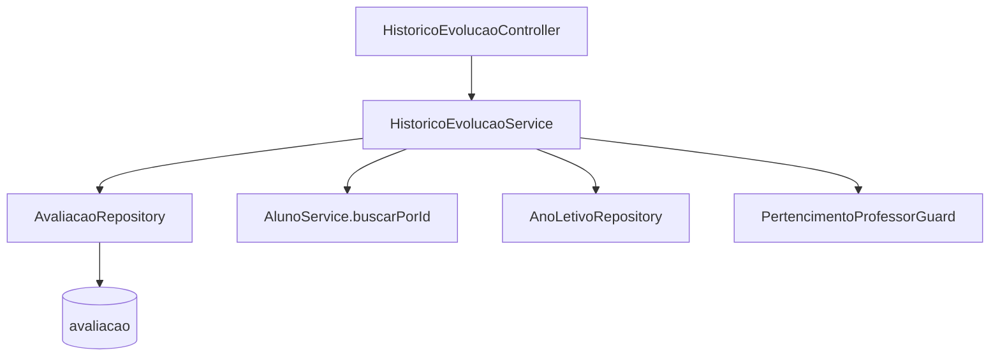

# Histórico e Evolução Design

**Spec**: `.specs/features/historico-evolucao/spec.md`
**Status**: Draft

---

## Architecture Overview

Feature 100% de leitura, sem novas tabelas: um `HistoricoEvolucaoService` novo consulta `Avaliacao` (feature `avaliacao`) através de três queries JPQL novas em `AvaliacaoRepository`, monta DTOs de resposta e aplica as regras de negócio (agrupamento "mais recente por grupo", evolução absoluta/percentual, divisão por zero). Um `HistoricoEvolucaoController` novo expõe os três endpoints somente leitura sob `/api/v1/alunos/{alunoId}`.



---

## Code Reuse Analysis

### Existing Components to Leverage

| Component | Location | How to Use |
| --- | --- | --- |
| `Avaliacao` (entidade + enums `StatusAvaliacao`, `Fase`, `TipoLeituraCodigo`) | `avaliacao/Avaliacao.java` | Fonte única de dados; nenhuma coluna nova necessária |
| `AvaliacaoRepository` | `avaliacao/AvaliacaoRepository.java` | Ganha 3 métodos `@Query` novos (ver Data Models) |
| `AlunoService.buscarPorId(Long)` | `cadastros/aluno/AlunoService.java:81` | Resolve o aluno + matrícula ativa; já lança `ALUNO_NAO_ENCONTRADO` (404) - reaproveitado tal como está |
| `PertencimentoProfessorGuard` | `common/security/PertencimentoProfessorGuard.java` | AUTH-09 no histórico: `verificar(matriculaAtiva.getProfessor().getId())`, mesmo padrão de `AlunoController.buscarPorId` |
| `ContextoUsuarioPort` | `common/security/ContextoUsuarioPort.java` | Perfil do usuário atual (usado indiretamente pelo guard) |
| `AnoLetivoRepository.findBySituacao(ATIVO)` | `cadastros/anoletivo/AnoLetivoRepository.java` | Resolve o ano ATIVO quando `anoLetivoId` não é informado em `evolucao-ciclos` (CAD-04 garante no máximo um ATIVO) |
| `AvaliacaoAudioRepository` | `avaliacao/AvaliacaoAudioRepository.java` | Ganha 1 método novo para marcar `temAudio` em lote no histórico (ver Data Models) |
| Paginação (`Page`/`PageRequest`, tamanho 20) | `cadastros/aluno/AlunoController.java` | Mesmo padrão aplicado ao histórico |
| `@Query` nativo/JPQL com filtros opcionais via `:param IS NULL OR ...` | `cadastros/aluno/AlunoRepository.java` | Estilo já usado no projeto para filtros dinâmicos |
| `BusinessException` + `GlobalExceptionHandler` | `common/error/` | 404/400 seguem o mesmo formato RFC 7807 (AD-006) |

### Integration Points

| System | Integration Method |
| --- | --- |
| `avaliacao` | Leitura direta via `AvaliacaoRepository` (mesmo módulo Spring, sem nova porta - a feature não escreve em `avaliacao`, só lê) |
| `cadastros-base` | Leitura via `AlunoService`/`AnoLetivoRepository`, sem alterações nesses componentes |
| Segurança | `@PreAuthorize` + `PertencimentoProfessorGuard`, mesmo padrão de todas as features anteriores |

---

## Components

### `HistoricoEvolucaoController`

- **Purpose**: Expor os 3 endpoints de leitura da feature.
- **Location**: `historicoevolucao/HistoricoEvolucaoController.java`
- **Interfaces**:
  - `GET /api/v1/alunos/{alunoId}/historico-avaliacoes?anoLetivoId=&tipoLeitura=&cicloId=&page=` → `Page<HistoricoAvaliacaoItemResponse>` - `hasAnyRole('PROFESSOR','COORDENADOR')`
  - `GET /api/v1/alunos/{alunoId}/evolucao-ciclos?anoLetivoId=&tipoLeitura=` → `EvolucaoCiclosResponse` - `hasRole('COORDENADOR')`
  - `GET /api/v1/alunos/{alunoId}/evolucao-anos?tipoLeitura=` → `EvolucaoAnualResponse` - `hasRole('COORDENADOR')`
- **Dependencies**: `HistoricoEvolucaoService`
- **Reuses**: Mesmo estilo de `AvaliacaoController`/`AlunoController` (métodos finos que delegam ao service e mapeiam para DTO `from(...)`)

### `HistoricoEvolucaoService`

- **Purpose**: Resolve aluno + ownership, consulta `AvaliacaoRepository`, aplica agrupamento "mais recente por grupo" e calcula evolução absoluta/percentual.
- **Location**: `historicoevolucao/HistoricoEvolucaoService.java`
- **Interfaces**:
  - `Page<Avaliacao> historico(Long alunoId, Long anoLetivoId, TipoLeituraCodigo tipoLeitura, Long cicloId, Pageable pageable): Page<Avaliacao>` - HIST-01, HIST-03, HIST-04, HIST-05, HIST-06
  - `Set<Long> comAudio(List<Long> avaliacaoIds): Set<Long>` - usado pelo controller/DTO para marcar `temAudio` sem N+1
  - `EvolucaoCiclos evolucaoPorCiclo(Long alunoId, Long anoLetivoId, TipoLeituraCodigo tipoLeitura): EvolucaoCiclos` - HIST-07..HIST-11
  - `List<EvolucaoAnualLinha> evolucaoAnual(Long alunoId, TipoLeituraCodigo tipoLeitura): List<EvolucaoAnualLinha>` - HIST-12..HIST-19
- **Dependencies**: `AvaliacaoRepository`, `AvaliacaoAudioRepository`, `AlunoService`, `AnoLetivoRepository`, `PertencimentoProfessorGuard`
- **Reuses**: `AlunoService.buscarPorId` (404), `PertencimentoProfessorGuard.verificar` (404 se professor não é dono), `AnoLetivoRepository.findBySituacao(ATIVO)` (ano default)

---

## Data Models

Nenhuma tabela nova. Três métodos novos em `AvaliacaoRepository` (JPQL, param `status` sempre `FINALIZADA`):

```java
// Histórico: lista paginada, filtros opcionais.
@Query("select a from Avaliacao a where a.aluno.id = :alunoId and a.status = :status "
        + "and (:anoLetivoId is null or a.anoLetivo.id = :anoLetivoId) "
        + "and (:tipoLeitura is null or a.tipoLeitura = :tipoLeitura) "
        + "and (:cicloId is null or a.ciclo.id = :cicloId) "
        + "order by a.dataAvaliacao desc, a.finalizadoEm desc")
Page<Avaliacao> buscarHistorico(
        @Param("alunoId") Long alunoId, @Param("status") StatusAvaliacao status,
        @Param("anoLetivoId") Long anoLetivoId, @Param("tipoLeitura") TipoLeituraCodigo tipoLeitura,
        @Param("cicloId") Long cicloId, Pageable pageable);

// Evolução por ciclo: todas as FINALIZADA de um (aluno, ano, tipo); service agrupa por ciclo.id
// pegando a 1ª de cada grupo (já ordenada por finalizadoEm desc dentro do grupo).
@Query("select a from Avaliacao a where a.aluno.id = :alunoId and a.status = :status "
        + "and a.anoLetivo.id = :anoLetivoId and a.tipoLeitura = :tipoLeitura "
        + "order by a.ciclo.id, a.finalizadoEm desc")
List<Avaliacao> buscarFinalizadasPorAnoETipo(
        @Param("alunoId") Long alunoId, @Param("status") StatusAvaliacao status,
        @Param("anoLetivoId") Long anoLetivoId, @Param("tipoLeitura") TipoLeituraCodigo tipoLeitura);

// Evolução anual: todas as FINALIZADA de um (aluno, tipo), todos os anos; service agrupa por
// (anoLetivo.id, ciclo.id) pegando a 1ª de cada grupo (mesma lógica acima), depois por ano.
@Query("select a from Avaliacao a where a.aluno.id = :alunoId and a.status = :status "
        + "and a.tipoLeitura = :tipoLeitura "
        + "order by a.anoLetivo.ano, a.ciclo.id, a.finalizadoEm desc")
List<Avaliacao> buscarFinalizadasPorTipo(
        @Param("alunoId") Long alunoId, @Param("status") StatusAvaliacao status,
        @Param("tipoLeitura") TipoLeituraCodigo tipoLeitura);
```

`AvaliacaoAudioRepository` ganha:

```java
// IN em memória (página tem no máximo 20 ids) - evita N+1 sem precisar de JOIN na query principal.
List<Long> findAvaliacaoIdByAvaliacaoIdIn(List<Long> avaliacaoIds);
```

### DTOs de resposta (`historicoevolucao/dto/`)

```java
record HistoricoAvaliacaoItemResponse(
        Long avaliacaoId, int anoLetivo, int serie, String turma, String professor,
        String ciclo, String tipoLeitura, LocalDate dataAvaliacao,
        int quantidadeTotal, int quantidadeCorretas, int quantidadeIncorretas, int quantidadeNaoLidas,
        BigDecimal percentualAcerto, String fase, Integer nivel,
        Integer tempoUtilizadoSegundos, boolean temAudio) {}

record ResultadoCicloResponse(
        String ciclo, LocalDate dataAvaliacao, int quantidadeCorretas,
        BigDecimal percentualAcerto, String fase, Integer nivel) {}
// null inteiro (não um record vazio) quando o ciclo não tem avaliação FINALIZADA (HIST-08).

record EvolucaoCiclosResponse(
        Long alunoId, int anoLetivo, String tipoLeitura,
        ResultadoCicloResponse entrada, ResultadoCicloResponse acompanhamento, ResultadoCicloResponse saida) {}

record EvolucaoValor(Integer absoluta, BigDecimal percentual) {}
// percentual null quando anterior = 0 e atual > 0 (HIST-19); ambos null quando não há ano anterior com esse ciclo.

record CicloAnualResponse(
        String ciclo, int quantidadeCorretas, BigDecimal percentualAcerto, String fase, Integer nivel,
        EvolucaoValor evolucao) {}

record EvolucaoAnualLinhaResponse(
        int anoLetivo, int serie,
        CicloAnualResponse entrada, CicloAnualResponse acompanhamento, CicloAnualResponse saida) {}

record EvolucaoAnualResponse(Long alunoId, String tipoLeitura, List<EvolucaoAnualLinhaResponse> anos) {}
```

**Relationships**: todos derivados 1:1 de `Avaliacao` + `Ciclo.codigo`; nenhuma persistência própria.

---

## Error Handling Strategy

| Error Scenario | Handling | User Impact |
| --- | --- | --- |
| Aluno não existe | `AlunoService.buscarPorId` já lança `BusinessException(404, ALUNO_NAO_ENCONTRADO)` | 404 padrão RFC 7807 |
| Professor não é dono do aluno (matrícula ativa) | `PertencimentoProfessorGuard.verificar` lança 404 (sem revelar existência) | 404, mesmo formato do resto do sistema |
| Coordenador-only endpoint chamado por Professor | `@PreAuthorize("hasRole('COORDENADOR')")`, Spring Security responde antes de entrar no método | 403 padrão do Spring Security |
| `tipoLeitura` ausente em `evolucao-ciclos`/`evolucao-anos` | `@RequestParam` sem `defaultValue` e sem `required = false` → Spring lança `MissingServletRequestParameterException`, já tratada pelo `ResponseEntityExceptionHandler` herdado (sem handler customizado necessário) | 400 (`ProblemDetail` padrão do Spring, sem `code` customizado - aceitável, não é um erro de regra de negócio) |
| `tipoLeitura`/`anoLetivoId`/`cicloId` com valor inválido (não é um `TipoLeituraCodigo`/id numérico) | Spring lança `MethodArgumentTypeMismatchException`, também herdada de `ResponseEntityExceptionHandler` | 400 |
| `anoLetivoId` informado não existe | `AnoLetivoRepository.findById(...).orElseThrow(...)` reaproveitando o código `ANO_LETIVO_NAO_ENCONTRADO` já usado em `AnoLetivoService` | 404 |
| Aluno sem nenhuma `FINALIZADA` (com ou sem filtros) | Query retorna vazio; service devolve página vazia / objeto com os 3 ciclos `null` / lista vazia - nunca 404 | 200 com coleção vazia |

---

## Risks & Concerns

| Concern | Location (file:line) | Impact | Mitigation |
| --- | --- | --- | --- |
| Sem índice composto cobrindo `(aluno_id, status, tipo_leitura)` - só `idx_avaliacao_aluno` e `idx_avaliacao_status` isolados (`V9__avaliacao.sql:54-55`) | `src/main/resources/db/migration/V9__avaliacao.sql:54` | As 3 queries novas filtram por `aluno_id` + `status` (+ `tipo_leitura`/`ano_letivo_id`); sem índice composto o MySQL varre todas as avaliações de um `aluno_id` e filtra o resto em memória | Não é um problema real nesta escala: um aluno tem no máximo dezenas de avaliações (3 ciclos × poucos anos), nunca milhares. Não se cria índice novo agora; revisitar só se o volume real mostrar necessidade |
| Divisão por zero (HIST-18/HIST-19) é lógica nova, fácil de errar (`0/0` vs `N/0`) | `historicoevolucao/HistoricoEvolucaoService.java` (novo) | Uma implementação ingênua (`(atual-anterior)/anterior*100`) lança `ArithmeticException` quando `anterior = 0` | Tratamento explícito antes da divisão: `anterior == 0` sempre desvia para a regra do spec (0 se atual também 0, `null` caso contrário) - nunca executa a divisão nesse caso |

> Nenhum outro risco novo encontrado - a feature não introduz escrita, migração nem dependência externa.

---

## Tech Decisions

| Decision | Choice | Rationale |
| --- | --- | --- |
| Pacote da feature | `historicoevolucao/` (novo, paralelo a `avaliacao/`, `bancopalavras/`, etc.) | Segue o padrão de 1 pacote por feature já usado no projeto; a feature não pertence a `avaliacao` (que já fechou com Verifier PASS) nem a `cadastros-base` |
| "Mais recente por grupo" resolvido em Java, não em SQL (sem `ROW_NUMBER()`/subquery de agregação) | Buscar todas as `FINALIZADA` do escopo (pequeno) ordenadas, agrupar com `Collectors.groupingBy(..., LinkedHashMap::new, ...)` pegando o 1º de cada grupo | Volume por aluno é pequeno (nunca precisa de paginação nessas duas consultas); evita SQL nativo dependente de MySQL 8 window functions só para um agrupamento trivial - mais simples de testar e ler |
| `temAudio` resolvido com 1 query `IN` extra em vez de `JOIN`/subquery `EXISTS` na query principal | `findAvaliacaoIdByAvaliacaoIdIn` sobre os ids da página atual (≤ 20) | Mantém a query de histórico simples e paginável; o custo de uma query `IN` extra por página é desprezível e evita duplicar a lógica de paginação num `JOIN` |
| Rota aninhada sob `/alunos/{alunoId}/...` | Assim como `MatriculaController` (`/alunos/{alunoId}/matriculas`) | Consistência com o padrão já estabelecido no projeto para sub-recursos do aluno |
| `evolucao-ciclos`/`evolucao-anos` restritos a `hasRole('COORDENADOR')` sem `PertencimentoProfessorGuard` | Checagem só por papel, sem checar aluno específico | Decisão do usuário (context.md): RF013 tratado como relatório gerencial, mesmo padrão do RF014; Coordenador já acessa qualquer aluno em todo o sistema |

> Nenhuma decisão aqui estabelece uma convenção nova de projeto (todas reaproveitam padrões já registrados em `AD-001..AD-008`) - nada a promover para `.specs/STATE.md`.
