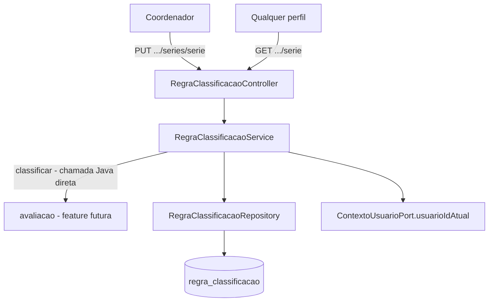

# Regras de Classificação Design

**Spec**: `.specs/features/regras-classificacao/spec.md`
**Status**: Approved

---

## Architecture Overview

Um novo pacote (`regrasclassificacao`, mesmo padrão flat de `bancopalavras`) com CRUD simples sobre uma única tabela (`regra_classificacao`), mais um método de domínio (`classificar`) chamado por Java direto - sem HTTP - pelas features futuras (`avaliacao`). Reaproveita a stack REST + JPA + Flyway já usada em `bancopalavras`/`cadastros-base` (Controller → Service → Repository → MySQL), com dois desvios pontuais: lock pessimista na substituição (novo padrão - abaixo) e uma pequena extensão de `ContextoUsuarioPort` para expor o id do usuário autenticado (REG-13).



---

## Code Reuse Analysis

### Existing Components to Leverage

| Component | Location | How to Use |
| --- | --- | --- |
| `BusinessException` (com `details`, AD-008) | `common/error/BusinessException.java` | Reusado sem alteração - `details={"valor": N}` para `FAIXA_COM_LACUNA`/`FAIXA_SOBREPOSTA` (mesmo padrão de `details.posicoes` do PAL-02) |
| `GlobalExceptionHandler` | `common/error/GlobalExceptionHandler.java` | Sem alteração - já copia `details` e já mapeia `MethodArgumentNotValidException` para `VALIDACAO_INVALIDA` |
| Padrão de entidade/repositório/service/controller de `bancopalavras` (T3-T15) | `bancopalavras/*` | Mesma estrutura: migração Flyway, entidade JPA simples, `@PreAuthorize("hasRole('COORDENADOR')")` na escrita, DTOs record com Bean Validation |
| `ContextoUsuarioPort` / `JwtContextoUsuarioAdapter` | `common/security/*` | **Estendido** (não só reusado) - ver Tech Decisions |
| `IntegrationTestBase`, `bearerCoordenador()` | `support/IntegrationTestBase.java` | Mesmo padrão de IT com Testcontainers MySQL |

### Integration Points

| System | Integration Method |
| --- | --- |
| MySQL (Flyway) | Nova migração `V7__regra_classificacao.sql`, mesma convenção de `V1`-`V6` |
| `avaliacao` (futura) | Chama `RegraClassificacaoService.classificar(int serie, int acertos)` direto via injeção Spring - sem endpoint HTTP dedicado para isso (RF011 não pede um) |
| `common.security` | `ContextoUsuarioPort` ganha `usuarioIdAtual()` (novo método) |

---

## Components

### `RegraClassificacao` (entidade JPA)

- **Purpose**: Uma faixa (banda de acertos) de uma série, com fase/nível resultantes.
- **Location**: `src/main/java/com/missio/fluencia_leitora/regrasclassificacao/RegraClassificacao.java`
- **Interfaces**: getters; `inativar(Long alteradoPor, Instant agora)` - seta `ativo=false` + os dois campos de auditoria numa só chamada, evita esquecer um dos dois em algum ponto de chamada.
- **Dependencies**: `Fase` (enum)
- **Reuses**: padrão de entidade de `bancopalavras.ListaPalavras` (construtor protegido sem args para o JPA, sem setters públicos além dos necessários)

### `Fase` (enum)

- **Purpose**: `PRE_LEITOR`, `LEITOR_INICIANTE`, `LEITOR_FLUENTE` - igual ao vocabulário do spec/SDD.
- **Location**: `src/main/java/com/missio/fluencia_leitora/regrasclassificacao/Fase.java`
- **Reuses**: mesma decisão de `bancopalavras.TipoPalavra`/`TipoLeituraCodigo` - enum Java mapeado `@Enumerated(STRING)`, sem FK para uma tabela de domínio (não há uma tabela de domínio para fase, e criar uma só para 3 valores fixos seria over-engineering)

### `RegraClassificacaoRepository`

- **Purpose**: Consultas por série (ativas, para classificar/consultar) e histórico completo, mais o lock pessimista da substituição.
- **Location**: `src/main/java/com/missio/fluencia_leitora/regrasclassificacao/RegraClassificacaoRepository.java`
- **Interfaces**:
  - `List<RegraClassificacao> findBySerieAndAtivoTrueOrderByQuantidadeMinimaAcertosAsc(int serie)` - GET e `classificar` (a lista de ativas de uma série tem no máximo ~6 linhas; filtrar o acerto certo em Java evita uma query própria por classificação)
  - `@Lock(PESSIMISTIC_WRITE) @Query(...) List<RegraClassificacao> buscarAtivasParaAtualizarComLock(int serie)` - usada só dentro de `substituir`, serializa dois `PUT` concorrentes na mesma série (spec: "o último a confirmar vence")
  - `@Query(...) List<RegraClassificacao> buscarHistoricoPorSerie(int serie)` - todas (ativas e inativas) ordenadas com `alterado_em IS NULL` primeiro (a versão corrente), depois `alterado_em DESC`
- **Dependencies**: Spring Data JPA
- **Reuses**: padrão `@Query` + `JpaRepository` de `bancopalavras.ListaPalavrasRepository` (T7)

### `RegraClassificacaoService`

- **Purpose**: Validação cruzada da substituição (REG-07..REG-13), classificação (REG-03..REG-05) e leitura (REG-06, REG-15).
- **Location**: `src/main/java/com/missio/fluencia_leitora/regrasclassificacao/RegraClassificacaoService.java`
- **Interfaces**:
  - `ClassificacaoResultado classificar(int serie, int acertos)` - `record ClassificacaoResultado(Fase fase, Integer nivel)`, ambos `null` quando nenhuma faixa cobre (REG-05). **Chamada Java direta, sem HTTP** - é o ponto de integração com `avaliacao`.
  - `List<RegraClassificacao> buscarAtivas(int serie)`
  - `List<RegraClassificacao> substituir(int serie, List<FaixaRequest> faixas)` - `@Transactional`; lê o usuário atual via `ContextoUsuarioPort` (injetado no service, como já é feito em `AlunoService`)
  - `List<RegraClassificacao> buscarHistorico(int serie)`
- **Dependencies**: `RegraClassificacaoRepository`, `ContextoUsuarioPort`
- **Reuses**: `BusinessException` (com `details`, AD-008); estrutura de validadores privados de `bancopalavras.ListaPalavrasService` (T10)

### `RegraClassificacaoController`

- **Purpose**: `GET /api/v1/regras-classificacao?serie=`, `PUT /api/v1/regras-classificacao/series/{serie}`, `GET /api/v1/regras-classificacao/historico?serie=`.
- **Location**: `src/main/java/com/missio/fluencia_leitora/regrasclassificacao/RegraClassificacaoController.java`
- **Reuses**: padrão `@PreAuthorize("hasRole('COORDENADOR')")` só no `PUT` (GETs abertos a qualquer perfil autenticado, igual a `bancopalavras`)

### DTOs

- `FaixaRequest(Integer quantidadeMinimaAcertos, Integer quantidadeMaximaAcertos, Fase fase, Integer nivel)` - `@NotNull @Min(0)` em `quantidadeMinimaAcertos`; `@Min(0)` em `quantidadeMaximaAcertos` (nullable); `@NotNull` em `fase`; `nivel` sem anotação de bound (a faixa válida depende de `fase` - cross-field, validado no service, igual ao padrão de PAL-12 em `bancopalavras`).
- `SubstituirRegrasClassificacaoRequest(@NotNull @Valid List<@NotNull FaixaRequest> faixas)` - `@NotNull` no elemento da lista aplica a lição L-019/L-023 (achadas em `banco-palavras`: um elemento nulo passa por `@Valid` sem erro e quebra mais tarde com 500). **Importante**: a lista vazia NÃO leva `@NotEmpty`/`@Size(min=1)` de propósito - o spec pede que lista vazia devolva o código de negócio `FAIXA_NAO_INICIA_EM_ZERO` (Edge Cases), não o `VALIDACAO_INVALIDA` genérico do Bean Validation; a checagem de vazio fica no service, junto da checagem "começa em zero".
- `RegraClassificacaoResponse(Long id, int serie, Integer quantidadeMinimaAcertos, Integer quantidadeMaximaAcertos, Fase fase, Integer nivel, boolean ativo, Long alteradoPor, Instant alteradoEm)`
- `HistoricoVersaoResponse(Instant alteradoEm, Long alteradoPor, List<RegraClassificacaoResponse> faixas)` - um grupo do histórico (P2); `alteradoEm=null` identifica o grupo corrente (ainda não substituído)

---

## Data Models

### Migração `V7__regra_classificacao.sql`

```sql
CREATE TABLE regra_classificacao (
    id BIGINT AUTO_INCREMENT PRIMARY KEY,
    serie TINYINT NOT NULL,
    quantidade_minima_acertos INT NOT NULL,
    quantidade_maxima_acertos INT NULL,
    fase ENUM('PRE_LEITOR','LEITOR_INICIANTE','LEITOR_FLUENTE') NOT NULL,
    nivel TINYINT NULL,
    ativo BOOLEAN NOT NULL DEFAULT TRUE,
    alterado_por BIGINT NULL,
    alterado_em TIMESTAMP NULL,
    criado_em TIMESTAMP NOT NULL DEFAULT CURRENT_TIMESTAMP,

    CONSTRAINT ck_regra_classificacao_serie CHECK (serie BETWEEN 1 AND 5),
    CONSTRAINT ck_regra_classificacao_minima CHECK (quantidade_minima_acertos >= 0),
    CONSTRAINT ck_regra_classificacao_intervalo
        CHECK (quantidade_maxima_acertos IS NULL OR quantidade_maxima_acertos >= quantidade_minima_acertos),
    CONSTRAINT ck_regra_classificacao_nivel
        CHECK ((fase = 'PRE_LEITOR' AND nivel BETWEEN 1 AND 4)
            OR (fase <> 'PRE_LEITOR' AND nivel IS NULL)),
    CONSTRAINT fk_regra_classificacao_usuario
        FOREIGN KEY (alterado_por) REFERENCES usuario(id)
);

CREATE INDEX idx_regra_classificacao_filtro ON regra_classificacao (serie, ativo);

-- Seed (spec.md, Assumptions - faixas contíguas aprovadas pelo usuário)
INSERT INTO regra_classificacao (serie, quantidade_minima_acertos, quantidade_maxima_acertos, fase, nivel) VALUES
(1, 0, 3, 'PRE_LEITOR', 1),
(1, 4, 5, 'PRE_LEITOR', 2),
(1, 6, 6, 'PRE_LEITOR', 3),
(1, 7, 7, 'PRE_LEITOR', 4),
(1, 8, 11, 'LEITOR_INICIANTE', NULL),
(1, 12, NULL, 'LEITOR_FLUENTE', NULL);

INSERT INTO regra_classificacao (serie, quantidade_minima_acertos, quantidade_maxima_acertos, fase, nivel)
SELECT serie, quantidade_minima_acertos, quantidade_maxima_acertos, fase, nivel
FROM (
    SELECT 2 AS serie, 0 AS quantidade_minima_acertos, 4 AS quantidade_maxima_acertos, 'PRE_LEITOR' AS fase, 1 AS nivel
    UNION ALL SELECT 2, 5, 7, 'PRE_LEITOR', 2
    UNION ALL SELECT 2, 8, 9, 'PRE_LEITOR', 3
    UNION ALL SELECT 2, 10, 11, 'PRE_LEITOR', 4
    UNION ALL SELECT 2, 12, 30, 'LEITOR_INICIANTE', NULL
    UNION ALL SELECT 2, 31, NULL, 'LEITOR_FLUENTE', NULL
) t;
-- Repetir o mesmo bloco de UNIONs para serie = 3, 4 e 5 (mesmas faixas do 2º ano, spec.md linha 31)
```

**Nota de execução (Tasks)**: o bloco de `serie=2` acima repete literalmente para `serie` 3, 4 e 5 - são 4 `INSERT` quase idênticos (só o valor de `serie` muda). A task de migração deve escrever os 4 por extenso (SQL não tem loop), não inventar uma abstração para isso.

### `RegraClassificacao` (entidade)

```java
@Entity
class RegraClassificacao {
    Long id;
    int serie;
    int quantidadeMinimaAcertos;
    Integer quantidadeMaximaAcertos; // null = sem limite (só a última faixa)
    Fase fase;
    Integer nivel; // 1-4 só quando fase=PRE_LEITOR, null caso contrário
    boolean ativo;
    Long alteradoPor; // id do usuario que inativou esta linha; null = versão corrente
    Instant alteradoEm; // null = versão corrente
    Instant criadoEm;
}
```

**Relationships**: `alteradoPor` referencia `usuario.id` (FK simples, sem `@ManyToOne` - só o id é usado, igual ao padrão de auditoria já usado no projeto).

---

## Error Handling Strategy

| Error Scenario | Handling | User Impact |
| --- | --- | --- |
| Lista de faixas vazia ou primeira faixa não começa em 0 | `BusinessException(422, "FAIXA_NAO_INICIA_EM_ZERO")` | 422 sem `details` |
| Lacuna entre faixas consecutivas | `BusinessException(422, "FAIXA_COM_LACUNA", details={"valor": N})` | 422 com o primeiro valor descoberto |
| Sobreposição entre faixas (inclui mínimos duplicados) | `BusinessException(422, "FAIXA_SOBREPOSTA", details={"valor": N})` | 422 com o primeiro valor duplicado |
| Última faixa (maior mínimo) com máximo != null | `BusinessException(422, "FAIXA_FINAL_LIMITADA")` | 422 |
| Faixa não-última com máximo null (ambíguo - cobre "até o infinito" no meio da lista) | Vira `FAIXA_SOBREPOSTA` na próxima faixa (o algoritmo de contiguidade trata máximo nulo como "sem limite superior", então a faixa seguinte sempre estará "coberta") | 422 `FAIXA_SOBREPOSTA` - não é um código dedicado; ver Tech Decisions |
| `fase=PRE_LEITOR` sem `nivel` 1-4, ou `fase` != `PRE_LEITOR` com `nivel` preenchido | `BusinessException(422, "FAIXA_NIVEL_INCOERENTE")` | 422 - código novo, spec não nomeia um (ver Tech Decisions) |
| `quantidadeMinimaAcertos` > `quantidadeMaximaAcertos` na mesma faixa | `BusinessException(422, "VALIDACAO_INVALIDA")` | 422 - sem código dedicado no spec, mesmo padrão do limite de 200 tokens em `bancopalavras` |
| `serie` fora de 1-5 no path | `@Min(1) @Max(5)` no `@PathVariable` (`@Validated` na classe) → `VALIDACAO_INVALIDA` | 422 |
| Dois `PUT` concorrentes na mesma série | Lock pessimista serializa - o segundo espera o primeiro commitar, não há exceção | Sem impacto visível; o segundo `PUT` só demora um pouco mais |

---

## Risks & Concerns

| Concern | Location (file:line) | Impact | Mitigation |
| --- | --- | --- | --- |
| Lock pessimista é um padrão novo neste projeto (as outras features usam `@Version` otimista) | `RegraClassificacaoRepository` (novo) | Se o teste de concorrência não for escrito com cuidado (duas transações reais, não só duas chamadas sequenciais no mesmo thread), o lock nunca é exercitado de verdade | Task dedicada de IT com duas threads/transações reais (ver tasks.md); documentado aqui e no Tech Decisions para o Verifier saber o que procurar |
| `ContextoUsuarioPort` ganha um método novo (`usuarioIdAtual()`) | `common/security/ContextoUsuarioPort.java` | Baixo - só uma implementação real (`JwtContextoUsuarioAdapter`) e alguns mocks em teste; nenhum mock quebra (Mockito não exige implementar todos os métodos) | Task própria e isolada (T1, antes de tudo o resto), com teste no adapter existente |
| Nenhuma tabela de domínio para `fase` (enum Java puro) | `regrasclassificacao/Fase.java` (novo) | Se o SDD já tiver outro lugar usando os mesmos rótulos via FK, haveria dois vocabulários | Mitigado: `grep` no repositório não achou nenhuma tabela `fase` existente; decisão consistente com `TipoPalavra` em `bancopalavras` |

> Nenhum outro risco encontrado na área tocada por esta feature.

---

## Tech Decisions

| Decision | Choice | Rationale |
| --- | --- | --- |
| `serie_inicial`/`serie_final` (intervalo) do spec.md vs. coluna única `serie` | Coluna única `serie TINYINT` | O spec.md (Assumptions, linha 35) já fixa "uma linha por série" como o comportamento real; a API só opera por série única (`PUT .../series/{serie}`); nada no spec exercita um intervalo. Segue o precedente de `configuracao_avaliacao.serie` (V2, também uma coluna única, não um intervalo). Adicionar as duas colunas agora seria construir para um requisito hipotético - se um intervalo for pedido depois, é uma migração nova. **Desvio da literalidade do spec.md - pedir confirmação do usuário.** |
| Código de erro para nível incoerente (AC7, "Configurar faixas") | `FAIXA_NIVEL_INCOERENTE` (novo, não nomeado no spec) | O spec pede 422 mas não nomeia um código, ao contrário das ACs 3-6. Um código dedicado segue o mesmo padrão de `CONTEUDO_INCOMPATIVEL_COM_TIPO` em `bancopalavras` (regra cruzada dentro do mesmo item) em vez de cair no genérico `VALIDACAO_INVALIDA`. **Nome sugerido - pedir confirmação do usuário.** |
| Faixa não-última com `quantidadeMaximaAcertos=null` | Vira `FAIXA_SOBREPOSTA` na próxima faixa (não um código dedicado) | O spec só define os dois casos "lacuna" e "sobreposição"; tratar `null` como "sem limite superior" no algoritmo de contiguidade cobre esse caso sem inventar um quarto código, e o efeito prático (uma faixa no meio "engole" as de trás) é mesmo uma sobreposição. |
| Concorrência na substituição | Lock pessimista (`SELECT ... FOR UPDATE`) nas linhas ativas da série, dentro da transação de `substituir` | O spec pede serialização explícita ("o último a confirmar vence"), e não há uma única linha para um `@Version` otimista representar "o conjunto de faixas da série" - o lock pessimista nas linhas ativas é a forma direta de serializar sem inventar uma tabela extra só para isso. |
| Ordenação do histórico com `alteradoEm` nulo | Grupo corrente (`alteradoEm=null`) aparece primeiro (mais recente) | "Ordem decrescente" - o grupo corrente é, por definição, o mais recente. MySQL ordena `NULL` como menor valor por padrão, então a query usa `ORDER BY (alterado_em IS NULL) DESC, alterado_em DESC` em vez de um `ORDER BY alterado_em DESC` simples (que colocaria o `null` por último). |
| `ContextoUsuarioPort.usuarioIdAtual()` | Novo método na interface existente (não uma interface nova) | `UsuarioAutenticado.usuarioId()` já existe no principal do `SecurityContext` (`common/security/UsuarioAutenticado.java:1`); só faltava expor via a porta. Reaproveitável por `avaliacao` (auditoria de mudanças pós-finalização, spec.md AD-002/AVA). |

> **Nenhuma decisão acima** define um padrão que outras features sejam obrigadas a seguir de forma exclusiva (lock pessimista é específico deste caso; `@Version` continua o padrão default para as demais). Não promovida a `STATE.md` `## Decisions`.

---

## Tips

- Reaproveitar ao máximo a estrutura de `bancopalavras` (T3-T15) - migração, entidade, repositório, service com validadores privados, controller, DTOs record com Bean Validation.
- O ponto novo de verdade é o lock pessimista - precisa de um teste de concorrência real (duas transações), não só uma chamada dupla no mesmo thread.
- `classificar(int serie, int acertos)` é a interface pública que `avaliacao` vai chamar depois - manter a assinatura estável.
